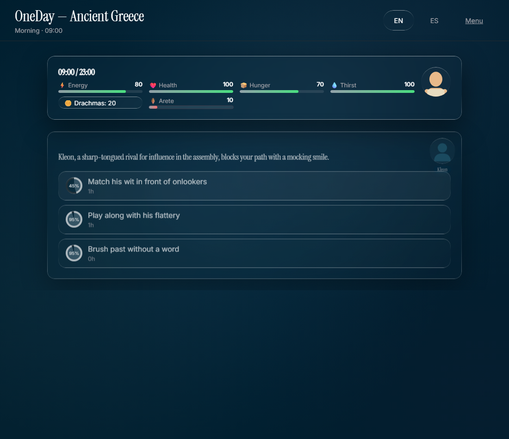
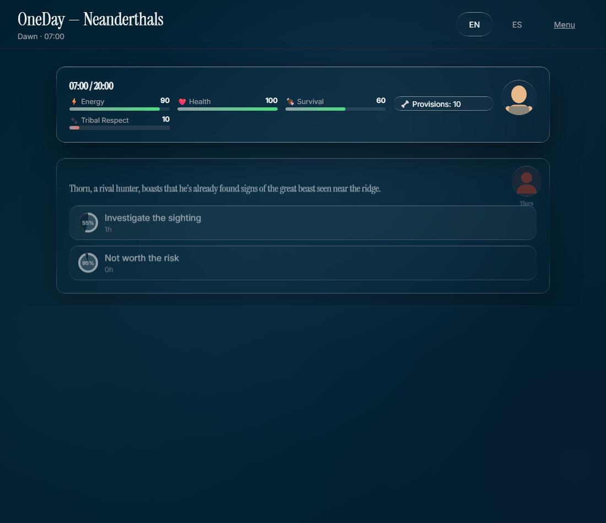
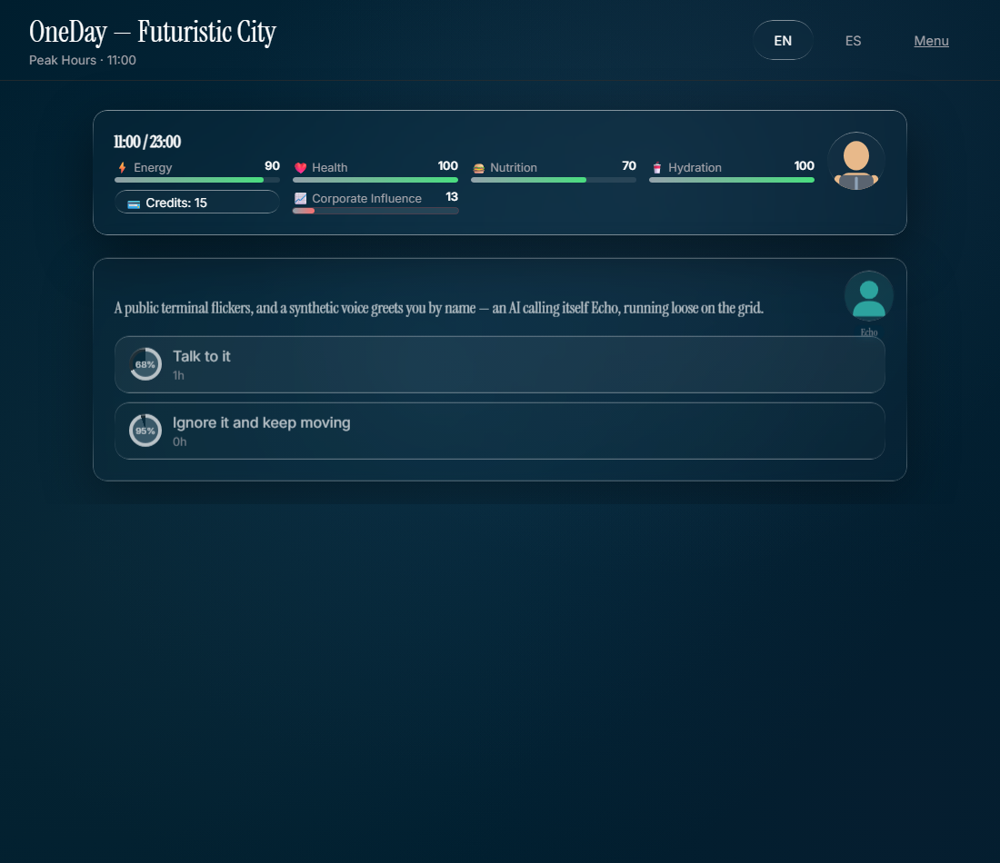
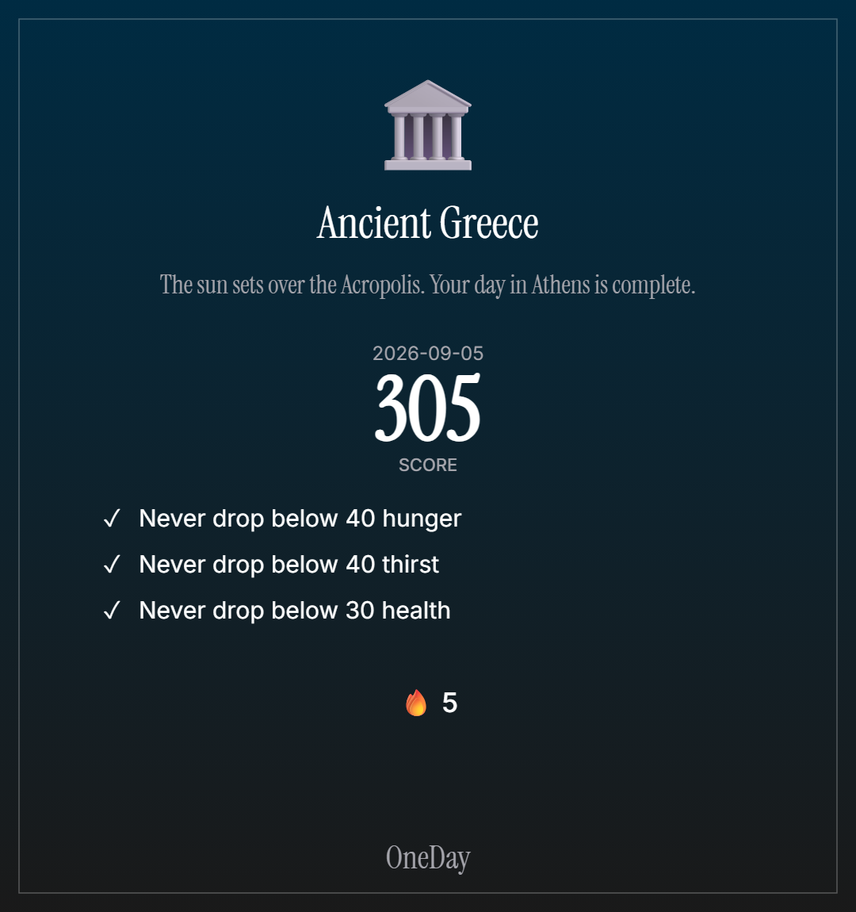

# OneDay

[](https://github.com/lucasmarjua-ui/oneday/actions/workflows/ci.yaml)
[](https://github.com/lucasmarjua-ui/oneday/actions/workflows/deploy.yaml)
[](LICENSE)
[](https://lucasmarjua-ui.github.io/oneday/)


OneDay is a data-driven decision game: pick an era, pick an archetype, customize a paper-doll character, then live a single day one decision card at a time. Every option costs time and resources and rolls against your archetype's strengths; the day ends when time runs out (a good ending) or a critical resource hits zero (a bad ending) — both with narrative text specific to the era. Built with HTML, CSS and vanilla JavaScript, no frameworks, no build step, fully bilingual (English/Spanish) from the first commit.

**[▶ Play now](https://lucasmarjua-ui.github.io/oneday/)**

## Play locally

No dependencies, no build step, nothing to install to play. The game uses native ES modules, so it needs to be served over `http://` rather than opened directly as a `file://` path (browser CORS rules block module imports from disk). Serve the repository root with any static server, for example:

```bash
python -m http.server 8000
```

Then visit `http://localhost:8000`. (A `package.json` exists only to mark the code as ES modules and to give the test suite a `npm test` command — there is nothing to `npm install`.)

## How to play

1. On the home screen, pick a language (EN/ES, top right) and an era: **Ancient Greece**, **Neanderthals** or **Futuristic City** — the three MVP eras, all playable.
2. Choose an **archetype** — Warrior, Orator or Philosopher — which fixes your success-chance bonuses for the rest of the playthrough. No option is ever fully blocked by your archetype; it just makes some routes more reliable than others.
3. Customize your character's appearance: base look, outfit, headgear and an accessory, each just swapping a simple SVG layer (no hand-drawn art per combination).
4. Click **Begin the Day**. The day runs from 07:00 to 23:00 in a shared time budget; each decision costs a variable number of hours, so a full day is roughly 8-20 decisions depending on your choices.
5. Each decision card presents 2-4 options. Every option shows its time cost, resource cost, and success chance before you commit. Success and failure each have their own resource changes and narrative text, and some outcomes set flags that unlock or block later cards in the same day. A handful of cards belong to **recurring named characters** (a merchant, a rival, a mentor — three per era) who reappear across the day with a small portrait and their own attitude toward you; if you're logged in, some of what happens with them carries into your *next* playthrough of that era. See [NPCs, narrative threads and cross-game memory](#npcs-narrative-threads-and-cross-game-memory) below.
6. The day ends one of two ways, each with its own narrative closing: **time runs out** (a normal ending), or a critical resource (health) **hits zero** (a bad ending, with era-specific flavor text). The summary screen then shows your final resources, a checklist of the 3 objectives randomly picked for that playthrough, and a short recap of what happened.
7. Some titles are **meta-achievements**: they require accumulating a resource (like lifetime Arete) across multiple playthroughs of the same era, tracked on your profile once you log in.
8. Each era card also has a **Today's Challenge** button: a shared daily seed instead of a random one, one attempt per player per era per day, and a same-day leaderboard. Completing it (while logged in) also keeps a single streak alive across all three eras, and its summary screen offers a themed, downloadable result card. See [Daily Challenge](#daily-challenge) and [Streaks and the shareable result card](#streaks-and-the-shareable-result-card) below.

## Architecture

```text
index.html                     Era selection, archetype choice, character appearance, login, profile
game.html                      The day loop: HUD, decision cards, outcomes, summary
favicon.svg                    Brand-colored favicon (a handful of SVG shapes, no binary asset)
assets/social-preview.png      Open Graph / Twitter card image (1200x630, built from the brand tokens)
shared/
  firebase-config.js           Firebase SDK initialization (client config, not a secret)
  auth.js                      Username/password auth + localStorage <-> Firestore sync
  era-registry.js              List of eras and loader for their era.json + cards.json
  rng.js                       Seeded PRNG (mulberry32) + seed generation (random and date-based)
  i18n.js                      Loads /data/i18n, tracks the chosen language, t()/localize() helpers
  resources.js                 Generic resource engine (create, apply deltas, clamp)
  day-engine.js                Time budget, current time-of-day slot, clock formatting
  character.js                 Paper-doll character creation, archetype selection, SVG render
  decision-engine.js           Card filtering by conditions/time slot, weighted pick, success rolls
  objectives.js                Daily objective pool selection and completion checks
  achievements.js              Cross-playthrough meta-progress and meta-achievement unlocks
  stats.js                     Per-era play statistics (days played, objectives completed)
  scoring.js                   Pure Daily Challenge score formula (objectives + resource tiebreak)
  daily-challenge-logic.js     Pure "already played today?" check (no Firebase import, unit-testable)
  daily-challenge.js           Daily Challenge localStorage cache + Firestore leaderboard read/write
  resource-bar.js              Pure resource-bar math (which resources bar, fill %, color level)
  card-icons.js                Infers a decorative category icon from a card's id (keyword match)
  atmosphere-bg.js             One generated fog/light-halo <canvas> background, mounted on every page
  narrative.js                 Applies deltas to narrative counters (NPC trust, thread progress)
  npc.js                       Looks up an era's NPC by id, renders its tinted-silhouette portrait
  memories-logic.js            Pure cross-playthrough memory rules (seed, extract, merge)
  memories.js                  localStorage read/write for a signed-in player's per-era memories
  streaks-logic.js             Pure Daily Challenge streak rule (extend/reset/merge)
  streaks.js                   localStorage read/write for the global Daily Challenge streak
  share-card.js                Renders a themed, downloadable PNG result card via <canvas>
  theme.css                    Shared visual theme: neutral defaults + every era's token overrides
data/
  i18n/en.json, es.json        Fixed interface strings (buttons, menus, labels)
  eras/greece/era.json          Resources, archetypes, day structure, character options, objectives, endings
  eras/greece/cards.json        Decision cards for Ancient Greece (bilingual text throughout)
  eras/neanderthal/era.json     Same schema, a different resource/archetype set (see Eras built so far)
  eras/neanderthal/cards.json   Decision cards for the Neanderthal era
  eras/future-city/era.json     Same schema again, full resource set + two new SVG character shapes
  eras/future-city/cards.json   Decision cards for the Futuristic City era
tests/*.test.js                Unit tests for the engine, run with Node's built-in test runner
firestore.rules                Firestore security rules, deployed via `firebase deploy --only firestore:rules`
firebase.json, .firebaserc     Points the Firebase CLI at the oneday-game project for that deploy
.github/workflows/ci.yaml      Runs the test suite on every push and pull request
.github/workflows/deploy.yaml  Publishes the static site to GitHub Pages on every push to main
```

Adding a new era means adding a new `data/eras/<id>/` folder (`era.json` + `cards.json`) and registering it in `shared/era-registry.js` — the engine itself does not change.

## The decision engine

Each era is entirely defined by two JSON files: `era.json` (resources, archetypes, day length, character customization options, objective pool, meta-achievements, ending narration) and `cards.json` (an array of decision cards). Nothing about a specific era is hardcoded in `shared/`. Every player-facing string is a bilingual object (`{ "en": "...", "es": "..." }`) rather than a plain string — see [Internationalization](#internationalization) below.

A decision card looks like this:

```json
{
  "id": "greece-market-haggle",
  "text": { "en": "A merchant in the agora offers imported pottery at a steep price.", "es": "Un mercader del ágora ofrece cerámica importada a un precio elevado." },
  "timeSlots": ["midday", "afternoon"],
  "weight": 4,
  "conditions": { "resources": { "currency": { "min": 5 } } },
  "options": [
    {
      "id": "haggle",
      "text": { "en": "Try to haggle the price down", "es": "Intenta regatear el precio" },
      "cost": { "time": 1, "resources": { "currency": -5 } },
      "successChance": { "base": 0.5, "archetypeBonus": { "modifier": "charm", "scale": 0.05 } },
      "success": { "resources": { "currency": 15, "reputation": 1 }, "text": { "en": "The merchant relents, impressed by your wit.", "es": "El mercader cede, impresionado por tu ingenio." }, "flagsSet": ["haggled-once"] },
      "failure": { "resources": { "reputation": -1 }, "text": { "en": "The merchant scoffs and waves you off.", "es": "El mercader se burla y te despacha con la mano." } }
    }
  ]
}
```

At each step, `getValidCards` filters the deck by the current time-of-day slot, resource conditions and required/excluded flags from earlier choices that day, then `pickWeightedCard` picks one using each card's `weight` and a **seeded RNG** (so, for example, a market card is more likely at midday than at midnight). `computeSuccessChance` clamps `base + archetypeModifier * scale` to `[0.05, 0.95]`, and the roll's outcome applies its resource deltas and any flags it sets. This small combinatorial space — ~25 cards × conditions × weighted time slots × archetype-influenced rolls — produces a different playthrough almost every time without hand-writing every path.

## NPCs, narrative threads and cross-game memory

Recurring characters, multi-card story chains, and continuity between playthroughs are built entirely on top of the existing card engine — no new engine was needed, per the schema proposed and approved before this content was written. Piloted first in Ancient Greece, then extended to Neanderthals and the Futuristic City with the exact same `shared/narrative.js` / `shared/memories-logic.js` / `shared/memories.js` / `shared/npc.js` modules — this section describes the one shared schema; each era's specific cast is content, not a second implementation.

- **NPCs** are declared once in `era.json`'s `npcs[]` array (`id`, bilingual `name`/`role`, `portraitColor`, `attitudeCounter`) — Greece ships 3 (Thales the merchant, Kleon the rival, Sophia the philosopher), deliberately kept small ("pocos y bien aprovechados"). A card opts into showing an NPC by adding `"npcId": "npc-thales"`; `shared/npc.js`'s `renderNpcPortraitSVG` draws a simple tinted bust silhouette (not the full paper-doll layering) in the card's corner, badged with the NPC's localized name.
- **Attitude** is tracked with `dayState.counters`, a parallel state bag to the existing `dayState.flags`. It exists because a relationship needs to *rise and fall* ("gain Thales' trust, then lose some of it"), which a boolean flag can't express — everything else about it reuses the engine verbatim: `conditions.counters: { merchantTrust: { min: 3 } }` is checked by the same `meetsResourceConditions` function resource conditions already used, and an outcome's `countersAdd: { merchantTrust: 2 }` accumulates via `shared/narrative.js`'s `applyCounterDeltas`, mirroring how resource deltas already worked.
- **Narrative threads** are just 2-4 cards tagged with the same descriptive `threadId` (metadata only, not read by the engine) whose appearance is gated by the flags each earlier card in the chain sets — an intro card excludes its own "met" flag, a follow-up requires it, a resolution requires the follow-up's outcome flag. Thales' and Sophia's threads reuse two *existing* cards as their intro step (retagged with an NPC) rather than adding parallel content that would have overlapped thematically; Kleon (new to this pass) gets a full 4-card arc: intro → scheme → resolution → a "remembers" variant for returning players.
- **Cross-game memory** persists only for signed-in players. `era.json` declares which flag/counter *names* are memorable via `memories: { flags: [...], counters: [...] }` — this is the deliberate "handful of recuerdos, not a full log" boundary: at day's end, `shared/memories-logic.js`'s `extractMemorableState` copies out only those declared names from that day's `dayState`, never the full flags/counters bag. `shared/memories.js` stores the result under `oneday.memories` in `localStorage`, synced through the same per-user Firestore document (`users/{uid}`, same security rule) as the rest of a player's progress. `selectMemorySeed` is the single place that decides continuity: it returns an empty seed unconditionally for a guest (`getCurrentUser() === null`), and the stored memories for a signed-in one; `createDayState(era, seed)` then pre-populates `flags`/`counters` from it before the first card is even drawn. A handful of cards (e.g. `greece-thales-remembers`) exist purely to react to a memory flag being present at time zero — Thales greets a past ally by name instead of running his generic first-meeting card, which is itself excluded once that memory is set.

## Archetypes

Character creation is a fixed choice, not a point-buy: pick one archetype, which sets fixed bonuses toward a shared skeleton of success-chance modifiers (`might`, `wits`, `charm`, and `luck` for eras that use it). Each era declares which modifiers it uses and defines 3-4 archetypes on top of them — same engine, different narrative dressing, exactly like resources. Ancient Greece uses three:

| Archetype | Modifier | Flavor |
|---|---|---|
| Warrior | `might` | Trained for combat and physical endurance. |
| Orator | `charm` | A persuasive voice in the agora and the assembly. |
| Philosopher | `wits` | Sharp-minded, favoring strategy over force. |

A card option references at most one modifier (`successChance.archetypeBonus.modifier`), so an archetype never fully locks a player out of a route — it just makes some options more or less reliable.

## Visual identity

OneDay went through two different visual systems. The first gave each era its own palette and typeface, applied at runtime via `shared/era-theme.js`. That system has been **fully replaced**, not layered under this one — `era-theme.js` is gone, and nothing in `shared/` reads `era.theme.colors`/`fonts` anymore. What distinguishes an era now is purely content: its name, NPCs, card text and icon, never its color or type.

**One cinematic identity for the whole game.** A single dark-navy palette (`--background: hsl(201 100% 13%)`, white foreground, muted-gray secondary text) and one type pairing — **Instrument Serif** for every heading/display moment, **Inter** for body text — apply everywhere, from the home screen through character creation, the day loop, and every summary screen. Every card, button, badge and panel shares one surface treatment, `.liquid-glass`: a near-transparent `backdrop-filter: blur()` fill with a soft gradient border traced by a `::before` pseudo-element (`mask-composite: exclude` cutting a ring out of a linear gradient) rather than a flat 1px border — the same trick used for `.panel`, `.btn`, `.era-card`, `.option-btn`, NPC/character portrait badges, and the chance-success ring, all defined together in `shared/theme.css` so no template needed an extra class for it. Status colors (the resource-bar green/amber/red, success/fail tags) are the one deliberate exception — those keep real meaning, only their container went glass. Era-select cards still preview each era's own background *texture* (a dot grid, a grain, a scanline pattern — still sourced from that era's `era.json`) so a card has *some* per-era visual texture, but the tint is now the same neutral white-on-glass as everywhere else — texture and icon distinguish a card now, not color.

Entrances use one `fade-rise` keyframe (`opacity 0→1`, `translateY(24px)→0`) at three stagger delays (`.animate-fade-rise`, `-delay`, `-delay-2`), reused for the hero copy, era cards, decision cards and summary reveals alike — one motion language instead of several per-screen animations.

### One generated atmosphere, everywhere

Every screen — home, era-select, character creation, the whole day loop in all three eras, every summary — sits over the exact same backdrop: a handful of slow-drifting, low-opacity radial-gradient "fog" blobs plus one soft light halo, all in the site's own navy hue, rendered on a single fixed, full-viewport `<canvas>` (`shared/atmosphere-bg.js`, `mountAtmosphereBackground()`) pinned behind all page content (`z-index: 0`, everything else in the game already sat at `z-index: 1` or higher for the critical-alert vignette, so no new stacking rules were needed). Both `index.html` and `game.html` call the same function once at startup — one shared component, not a per-screen effect or something reimplemented on each page.

This replaced an earlier version of this same idea that used a real screen-recorded video loop instead of generated fog. Two things pushed it toward canvas instead: wanting the exact same backdrop behind decision cards and the day loop too (a single looping video working believably as the backdrop for gameplay screens it wasn't recorded *of* would have looked wrong), and wanting one small file with full control over its exact color, rather than a multi-megabyte video asset to maintain. The canvas approach is also cheaper at runtime once it's playing everywhere rather than one hero screen: gradient *stops* fade to transparent instead of an expensive per-frame blur filter, the canvas is capped at 1.5x device pixel ratio, and the draw loop self-throttles to ~24fps — verified via Playwright's `PerformanceObserver('longtask')` API under iPhone 13 emulation with the animation running continuously: zero long tasks (0ms) over a 3-second sample, and UI clicks (era → archetype transition) still resolved in under 150ms. `prefers-reduced-motion: reduce` freezes it on a single static frame.

The nav (logo, Home/How it works/Today's Challenge/Profile links, language toggle, login, and a glass "Get Started" pill) is its own persistent header, shown on every phase of the home page, not nested inside the decorative hero band — an earlier structure that put it *inside* `.hero` meant the whole nav (including language and login) disappeared the moment you moved into character creation, since that section hides once an era is picked. Both CTA buttons (nav and hero) just smooth-scroll down to the era cards — there's no separate "start" page, the cards are the beginning.

A three-step "How it works" strip (choose your era → live the day → discover your ending) sits below the era cards for a first-time visitor sizing up the game before committing to one.

### End-of-day summary

The summary screen inherits the same global glass/navy identity as every other screen. What it didn't have was any sense of payoff:

- The ending line itself is now a bordered banner in success or danger colors depending on which ending you got (`.ending-banner.good` / `.bad`), set in the era's own heading font — the first thing that tells you, at a glance and before reading a word, whether this was a good day or not.
- Each daily objective in the checklist reveals with a short staggered fade-in (`.reveal`, ~120ms apart) instead of all snapping in at once, so a run with several completed objectives reads as a small cascade of wins rather than a static list.
- Final resource stats, and the Daily Challenge score breakdown when present, get the same staggered reveal.

### Game screen polish

- **Character portrait**: a small circular crop of the same `renderCharacterSVG` output from character creation, pinned in the HUD for the whole day — you're no longer flying blind on what you look like once play starts.
- **Resource bars**: any resource with a bounded range (`max - min <= 100`) renders as a filled bar that shifts green → amber → red as it drains, via the pure `shared/resource-bar.js` (`resourceFraction`, `resourceBarLevel`, unit-tested). Currency stays a plain chip — its `max` of 999999 exists specifically to mean "no real ceiling," so a bar for it would always look empty.
- **Success-chance dial**: each option with real risk shows a small `conic-gradient` ring instead of a bare "62% success" string.
- **Card category icon**: a large, low-opacity SVG watermark behind each card's text, chosen by `shared/card-icons.js`'s `classifyCardIcon()`. This infers a category from keywords in the card's own `id` (`market`/`haggle` → a shop icon, `water`/`hydro` → a droplet, `wrestl`/`hunt`/`predator` → crossed blades, …) rather than adding a new field to card JSON, so no era's content files needed touching for this. An id matching nothing falls back to a generic icon — never breaks, worst case is a slightly-wrong watermark.
- **Motion**: a new card/outcome/summary panel plays a brief fade-and-rise on arrival; a resource's number does a quick "tick" scale when it changes value this turn; a critical resource's bar pulses in place, and the whole screen gets a subtle inset red vignette pulse while any critical resource is in its danger zone — cleared the moment the day ends.

## Seeded RNG

`shared/rng.js` provides a `mulberry32`-based seeded PRNG. Every function in the engine that needs randomness (`pickWeightedCard`, `resolveOption`, `pickDailyObjectives`) takes an `rng` function as a **required** argument — nothing in the engine calls `Math.random()` directly. Each playthrough creates one RNG instance from a seed (`createRng(randomSeed())` for free play, `createRng(dailySeed(eraId, date))` for the Daily Challenge) and threads it through the whole day, so a given seed with the same choices always reproduces the exact same playthrough (see `tests/greece-data.test.js` for a determinism test that plays two identical seeded runs and asserts identical card sequences and final resources).

`dailySeed(eraId, date)` hashes a date + era id into a seed, so every player gets the exact same card sequence and roll outcomes for the same choices on a given day. This is the seed source behind [Daily Challenge](#daily-challenge) mode below — the engine needed no changes to support it, only a different `rng` source at the top of `game.html`'s `resetDay()`.

## Internationalization

The interface and all content are bilingual (English/Spanish) from the first commit:

- Fixed interface strings (buttons, headings, form labels) live in `data/i18n/en.json` and `data/i18n/es.json`, loaded once and looked up with `t(key)` from `shared/i18n.js`.
- Every piece of content text inside `era.json` and `cards.json` — card and option text, outcomes, resource/archetype/slot labels, objective descriptions, achievement titles, ending narration — is an object `{ "en": "...", "es": "..." }` instead of a plain string, read with `localize(field)`.
- The language selector (EN/ES buttons in the header) persists the choice to `localStorage` and re-renders the current screen in place via `onLanguageChange`, without losing game state.
- Code, variable/function names, comments and this README stay in English, matching the rest of this portfolio — only player-facing text is bilingual.

## Meta-progress and achievements

Two separate layers of goals:

- **Daily objectives**: 3 are picked at random (via the seeded RNG) from the era's `objectivesPool` at the start of each playthrough (e.g. "reach 300 drachmas", "never drop below 30 health"), checked against the day's final state and shown as a checklist on the summary screen.
- **Meta-achievements**: persistent titles tied to the player's account, unlocked by accumulating a resource across multiple playthroughs of the same era (e.g. "Archon of Athens" at 500 lifetime Arete earned). Progress is stored locally under the `oneday.progress` key, synced (like the rest of a signed-in player's data) inside their `users/{uid}` Firestore document, and checked at the end of every day.

## Daily Challenge

Each era's "Today's Challenge" button plays the same engine with one difference: `resetDay()` seeds its RNG from `dailySeed(eraId, today)` instead of `randomSeed()`. Since daily objectives are picked from that same RNG instance (`pickDailyObjectives` runs first, before any card is drawn — this was already how `resetDay()` worked for free play, so the objectives were never a special case), every player gets the identical card sequence, roll outcomes *and* objective set for a given era on a given day. Only the choices a player makes — which option they pick at each card, and which archetype/appearance they chose beforehand — can change the outcome. `tests/daily-challenge.test.js` verifies this directly: two independent simulated playthroughs sharing a seed and making the same choices produce an identical card sequence, objective set and final resources; different choices on the same seed can diverge; and the same era on a different day produces a different sequence.

**One attempt per player per era per day.** A local cache (`oneday.dailyChallenge` in `localStorage`) is checked before starting: if today's era already has a result cached, the saved summary is shown immediately instead of a fresh playthrough — this is what makes the "already played" experience instant rather than a wasted trip through character creation. For a logged-in player, that's backed by something stronger than `localStorage`: `firestore.rules` allows a `dailyLeaderboards/{eraId}-{date}/entries/{uid}` document to be **created but never updated or deleted**. A first score submission after finishing the day succeeds; any second attempt — from the same device with cleared storage, or a different device entirely — is rejected server-side regardless of what the client believes, so the competitive leaderboard can't be farmed by replaying for a better roll. Guests can still play (and get shown their own last result locally), they just don't have a server-side record and don't appear on the leaderboard, matching how guest mode already works everywhere else in this project.

**Scoring** (`shared/scoring.js`, pure and unit-tested): each completed daily objective is worth a flat 100 points; a small 0-10 point tiebreak is added from final health and currency (both normalized — currency against a fixed 500-credit/drachma/provision reference cap rather than each resource's own `max`, since `currency.max` is set to 999999 specifically to mean "no real ceiling" and would make a max-normalized tiebreak worthless). The tiebreak is capped well under one objective's value on purpose, so it can only rank players who completed the *same* number of objectives — it can never let a worse day with better leftover resources outscore a better one. A day that ends in the bad ending scores from whatever objectives and resources it reached, exactly like a day that ends normally; no separate penalty is needed since dying early already means fewer completed objectives.

**Leaderboard**: top 10 scores for today's challenge in that era, read from the same `dailyLeaderboards/{eraId}-{date}/entries` collection, shown on the summary screen (fresh completion or the "already played" view alike). The visible name is simply the player's existing login `displayName` — already captured as their chosen username at registration in `shared/auth.js`, so no new profile field was needed. Firestore calls in `shared/daily-challenge.js` are wrapped in an 8-second timeout: against an unconfigured Firebase project (the placeholder committed here until a real one is wired up — see below), the SDK's promises were found to hang indefinitely rather than reject, which would otherwise leave the leaderboard stuck on "Loading…" forever.

A global, all-time leaderboard for free-play scores (not just the Daily Challenge) would reuse this same read/write pattern easily, but is left for later — it wasn't needed to ship this feature.

## Testing

**126 tests**, zero test-framework dependencies, using Node's built-in test runner. The engine's rules (card filtering, weighted selection, success-chance math, objective checks, RNG determinism) are covered directly. Each era also has its own `tests/<era>-data.test.js` that validates its real `era.json`/`cards.json` content: every field that should be bilingual actually is, every archetype bonus references a modifier the era declares, every NPC has a unique id and attitude counter, every `npcId`/`threadId` a card carries resolves and chains 2-4 cards, every memorable flag/counter is actually set by some card and isn't copied verbatim from another era, and a simulated day across 100 different seeds always terminates without throwing. `tests/scoring.test.js` and `tests/daily-challenge.test.js` cover the Daily Challenge specifically: the scoring formula's invariants (objectives dominate, the tiebreak never outweighs one), the "already played today" date logic, and cross-player/cross-day seed determinism. `tests/memories-logic.test.js` and `tests/streaks-logic.test.js` cover cross-game memory and the Daily Challenge streak: seeding is empty for a guest regardless of stored data, only declared-memorable state graduates into storage, and the streak's extend/reset/merge rules (including a month-boundary edge case) — all pure logic, so none of this needs a DOM or a real Firebase project. The Firestore-touching parts of `shared/daily-challenge.js`, `shared/auth.js`, `shared/memories.js` and `shared/streaks.js` are, like the rest of this project's storage code, verified in the browser instead (see below), not unit tested; `shared/share-card.js`'s canvas rendering is verified the same way — by actually generating and downloading a card, not by asserting on pixels.

```bash
npm test
```

`.github/workflows/ci.yaml` runs this on every push and pull request.

## Accounts and progress (Firebase)

OneDay uses its own Firebase project, independent of any other project in this portfolio. It works fully as a guest with no account: character, progress and stats are saved to `localStorage`. Logging in creates or authenticates with a **username and password** (internally mapped to a generated email, `username@oneday.local` — a real email is never asked for or shown). On login, local progress is merged into the `users/{uid}` Firestore document and kept in sync from then on.

The project is `oneday-game`, created and configured via the Firebase CLI (`firebase.json` + `.firebaserc` point at it) — `shared/firebase-config.js` holds its real client config (these are public client identifiers, not secrets; the actual security boundary is `firestore.rules`, deployed to this project with `firebase deploy --only firestore:rules`, which also creates the Firestore database itself on first deploy if it doesn't exist yet).

### One manual console step

Everything above is CLI-automatable. The one thing Google requires a human to click through, for every Firebase project — no API or CLI path around it:

**Authentication → Get started → Sign-in method → Email/Password → Enable**, then **Authentication → Settings → Authorized domains**: add `lucasmarjua-ui.github.io` so login also works on GitHub Pages (`localhost` is already authorized).

Guest play — the whole game, minus accounts and the leaderboard — works without this step.

## Technical decisions

**No build step, no frameworks.** The whole project is HTML, CSS and vanilla JavaScript with native ES modules. GitHub Pages serves the repository as-is, and anyone can clone it and open it (behind a static server) without installing anything. `package.json` exists only to declare ES module semantics for Node's test runner and has zero dependencies.

**Procedural character art, no image assets.** The paper-doll character is drawn entirely as inline SVG primitives (`shared/character.js`), colored and shaped from each era's `era.json`. Adding a new era's wardrobe means adding shape/color entries to a config file, not commissioning or hand-editing art.

**Data-driven content, engine-agnostic of era.** All narrative content, resources, archetypes and character options live in per-era JSON. The engine only knows about generic concepts (resources, modifiers, time slots, flags), so a new era is pure content, no code changes.

**Seeded RNG as a first-class dependency, not an afterthought.** Every random draw takes an explicit `rng` argument; nothing falls back to `Math.random()`. This keeps playthroughs reproducible for debugging today and makes the Daily Challenge mode (same seed for every player on a given day) a content/UI feature to add later, not an engine rewrite.

**The favicon and social-preview image follow the same "no external art" rule.** `favicon.svg` is a handful of `<circle>`/`<line>` elements in brand brass on charcoal — no binary asset, no icon generator. `assets/social-preview.png` (the Open Graph/Twitter card image) is a small standalone HTML page built from the same brand tokens (Fraunces wordmark, the three-accent gradient blend, one chip per era) and rendered to a PNG at exactly 1200×630 — a design artifact kept alongside the source, not a one-off Photoshop export nobody can reproduce.

## Screenshots


The home screen keeps OneDay's own neutral identity — era themes only apply once you're inside one.


Archetype and paper-doll character customization, already themed to the chosen era.

| | |
|---|---|
|  Ancient Greece — marble & terracotta, Kleon (a recurring rival NPC) mid-card |  Neanderthals — cave & embers, Thorn the rival hunter |


Futuristic City — neon & concrete, first contact with Echo, a rogue AI


Daily Challenge summary: the era's own narrative ending, score, and an active streak badge


The downloadable result card generated from that same summary, themed to the era it was played in

## Eras built so far

**Ancient Greece** (Warrior/Orator/Philosopher, `might`/`wits`/`charm`) was the original pilot. **Neanderthals** (Hunter/Shaman/Forager, `might`/`wits`/`luck`) was built second, specifically to stress-test whether the schema generalizes to a genuinely different world without touching `shared/`:

- **Resources**: Neanderthal fuses `hunger`/`thirst` into a single `survival` resource and drops separate `energy`/`hunger`/`thirst` pairing entirely — a different resource *set*, not just relabeled values. Every module that reads resources (`shared/resources.js`, the HUD, the summary screen, option-cost formatting) already iterates `era.resources` generically; nothing needed to change.
- **Archetypes**: Neanderthal introduces `luck` as an active modifier (unused by Greece) and drops `charm` — confirming the archetype system isn't implicitly tied to Greece's three names or roles.
- **Currency**: Neanderthal reuses the `currency` key internally (as "mismo motor, distinto disfraz" intends) for a survival-flavored "Provisions" resource instead of Greece's money-like "Drachmas". Nothing in the engine treats `currency` as behaviorally special — it's clamped and compared exactly like any other resource — so the key name carries no hidden economic assumption.
- **Character art**: Neanderthal's furs/head/tool wardrobe reuses Greece's existing SVG shape primitives (a rectangle torso as a hide wrap, a rod as a spear, a circle as a hide pouch) recolored and relabeled per era.json — no new shapes were added to `shared/character.js`.

No engine or schema changes were required — `data/eras/neanderthal/` plus one registration line in `shared/era-registry.js` was enough. `tests/neanderthal-data.test.js` encodes this as a regression check (different resource/modifier sets from Greece, `luck` actually exercised by a card, bilingual coverage, and a 100-seed simulated-day crash/determinism check), alongside the pre-existing `tests/greece-data.test.js`.

**Futuristic City** (Hacker/Executive/Runner, `might`/`wits`/`charm` — the same three modifiers as Greece) completes the MVP trio as an intentional "middle" case: structurally close to Greece (full six-resource set, an economy + reputation resource, no fusion), but with a fully distinct tone (gig-economy deliveries, corporate ladder-climbing, a hidden-server hacking questline mirroring Greece's shrine and Neanderthal's cave). Its wardrobe needed genuinely new visuals — a jumpsuit, an AR visor, a datapad, a companion drone — that the existing rod/rectangle/circle primitives from Greece and Neanderthal couldn't credibly stretch to. That required one small, deliberate engine change: `shared/character.js`'s shape renderers now take an optional second `accentColor` (alongside the existing `color`), sourced from `era.json` like every other visual property, so a shape can have a two-tone glow/highlight without hardcoding it into the renderer function itself (the mistake `tunic-fine`'s baked-in gold sash made in Greece — left as-is there, not repeated here). `tests/character.test.js` covers the fallback behavior directly (no accent color falls back to the base color, never a fixed default) alongside `tests/future-city-data.test.js`'s usual bilingual/schema/simulated-day checks.

**Recurring NPCs, narrative threads and cross-game memory** (see the section above) started as a Greece-only pilot and are now built out in all three eras, reusing the same four `shared/` modules unchanged — each era only adds `npcs[]`, retagged/new cards, and a `memories` declaration in its own `era.json`/`cards.json`:

- **Neanderthals** — Kaia (shaman/mentor), Thorn (rival hunter) and Ember (clan chief). Kaia's and Thorn's arcs lean almost entirely on existing content: `neanderthal-shaman-ritual` + `neanderthal-elder-wisdom` became Kaia's intro and follow-up outright, and Thorn's arc is three retagged cards in a row — `neanderthal-beast-tracks` (he spots the tracks first), `neanderthal-great-hunt` (you race him for the kill), `neanderthal-injured-tribesman` (he turns up wounded from that same hunt) — with only a "remembers" card added new. Ember needed the most new content (only `neanderthal-share-meal` existed as a natural chief-judges-you moment); `neanderthal-ember-counsel` deliberately gates on a `conditions.counters` threshold (`chiefFavor >= 2`) rather than a flag, since "will she trust you with tribal politics" is a matter of degree, not a one-time event — the first real content use of that condition type beyond Greece's generic tests.
- **Futuristic City** — Vance (corporate recruiter), Nyx (street fixer) and Echo (a rogue AI assistant). All three reuse two or three *existing* cards outright: `futurecity-corp-recruiter` → `futurecity-boardroom-pitch` → `futurecity-corner-office` (already flag-chained through `impressed-board`) became Vance's full 3-card arc with only a "remembers" card added; `futurecity-hidden-server-rumor` → `futurecity-hidden-server` became Nyx's intro and climax; `futurecity-network-glitch` → `futurecity-data-broker` became Echo's intro and follow-up. Echo was the one adaptation the brief's suggested cast didn't fit cleanly — there was no existing "meet an AI" card to retag, so the mysterious terminal voice in `futurecity-network-glitch` (originally just "someone left a session open") became Echo's entry point instead, and her arc closes with a new card offering a deeper neural link, letting `echoTrust` mean something closer to "how much of yourself you let it into" than a simple like/dislike meter.

Each era declares its own memorable flags/counters with names that mean something in that world — `remembered-helped-thorn`/`thornRespect` for Neanderthals, `remembered-nyx-cut`/`nyxTrust` for the Futuristic City — never Greece's names copied over; `tests/neanderthal-data.test.js` and `tests/future-city-data.test.js` assert this directly, alongside the same NPC-cast-size, `npcId`/`threadId`-resolves, and memorable-name-is-actually-set checks Greece's tests already ran.

## Streaks and the shareable result card

Both features hang off the same moment — finishing a Daily Challenge attempt — and both are account-gated, same as cross-game memory: a guest gets no streak and no continuity, which is the accepted fallback for now while real login is being fixed separately.

- **Streak**: one global counter (`oneday.streak`), not per-era, so playing any era's Daily Challenge keeps it alive — stored in the same `users/{uid}` document as everything else, no new collection. The update rule lives in `shared/streaks-logic.js`'s pure `computeStreakUpdate(current, todayKey)`: same day as last played → unchanged (so re-viewing an "already played today" recap never double-counts); exactly one day later → `currentStreak + 1`; any bigger gap (or never played) → reset to 1. `longestStreak` only ever moves up. `mergeStreak` resolves a merge by trusting whichever side has the more recent `lastPlayedDate` for the current state, while always keeping the higher `longestStreak` from either side — a stale device can't roll back a streak, and a personal best is never lost. It's recorded in `endDay()` right where memories already are, gated on `isDaily && getCurrentUser()`, and shown on the summary screen once it's above 1 (not worth announcing "1-day streak") plus as a running total in the Profile modal.
- **Shareable result card**: a "Download card" button on the Daily Challenge summary renders a PNG via `shared/share-card.js` — an offscreen `<canvas>` drawn in OneDay's global navy/glass/Instrument-Serif identity, the same as every other screen (this module originally themed the card per-era; that was removed along with the rest of the per-era palette system, and it now draws from a small fixed `PALETTE` constant instead). What still varies by era is the icon and name shown on it, and its ending narration (`goodEnding`/`badEnding`) as the card's headline text instead of generic "day complete" copy, so the card still carries that era's voice even though it no longer wears that era's colors. Downloads via `canvas.toBlob` + a temporary `<a download>`. Untested by design (per the brief: worth confirming it doesn't crash, not worth unit-testing pixel output) — verified instead by actually downloading a card in the browser.

## Known gaps

- **Email/Password sign-in isn't enabled yet in the live Firebase project.** The one manual console step described above (**Authentication → Sign-in method → Email/Password → Enable**) hasn't been done for `oneday-game`. Until it is, logging in on the live site fails, which means every account-gated feature — cross-game memory, the Daily Challenge streak, and leaderboard participation — silently behaves exactly like guest mode there: the game is fully playable, it just doesn't remember or rank you yet. This is a deliberate, low-priority gap while the project isn't public yet, not a bug in the feature logic itself, which is unit-tested and was verified in the browser against a stand-in for a logged-in session.
- **Card pools are intentionally small (18-25 cards per era) for an MVP**, not the 40-60 a long-lived version would want — a full day can repeat the same filler cards on a longer or unlucky run.
- **No global, all-time leaderboard for free play** — only the Daily Challenge has one; a regular playthrough's score is never submitted anywhere.
- **No achievements showcase or Hall of Fame screen.** Meta-achievement *progress* is tracked and unlockable (see [Meta-progress and achievements](#meta-progress-and-achievements)), but there's no dedicated gallery view of unlocked titles or historical best scores across players.

## Possible future directions

Not active plans — this project is closed as a finished portfolio piece as of this round of work. If it were picked up again: an achievements showcase and a Hall of Fame in the Profile screen; a global, all-time free-play leaderboard per era (same Firestore pattern as the Daily Challenge's, without the daily reset or the create-only lock); growing all three eras' card pools toward 40-60 cards each; a fourth, dystopian city era (content only, same engine); more meta-achievements per era.

## License

MIT. Copyright Lucas Martinez, 2026. See [LICENSE](LICENSE).
