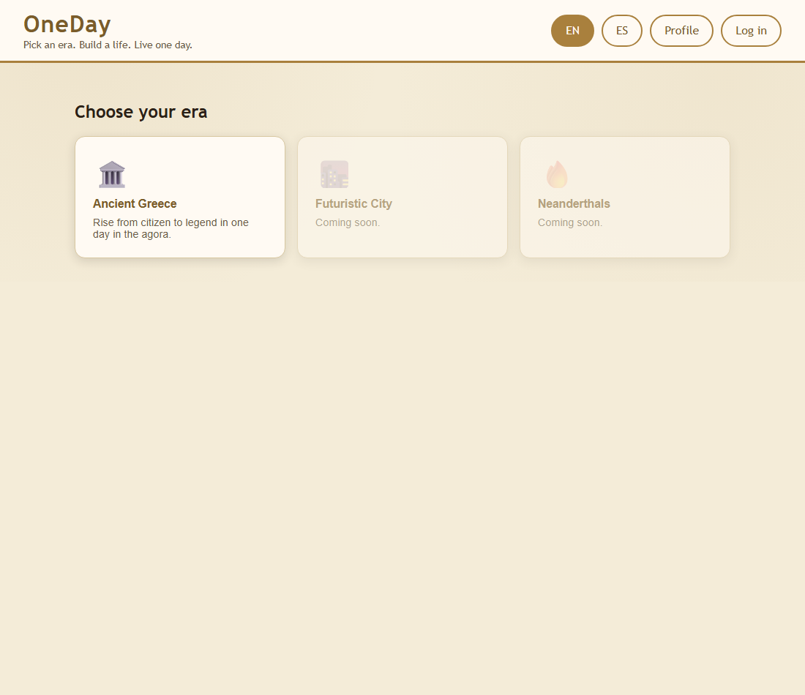
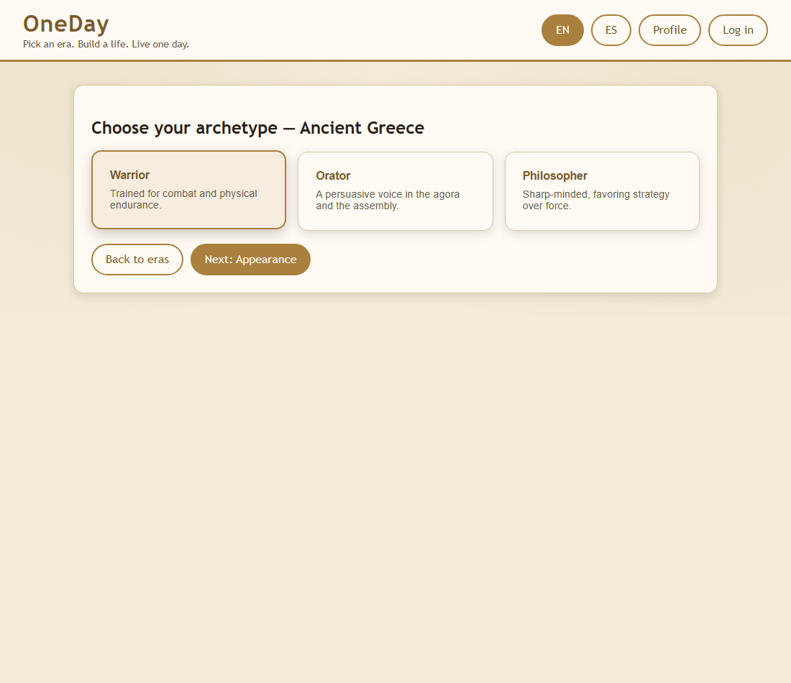
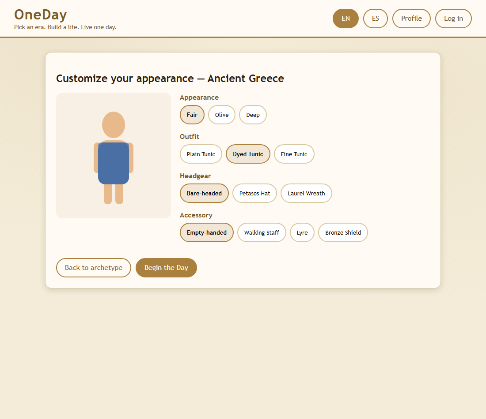
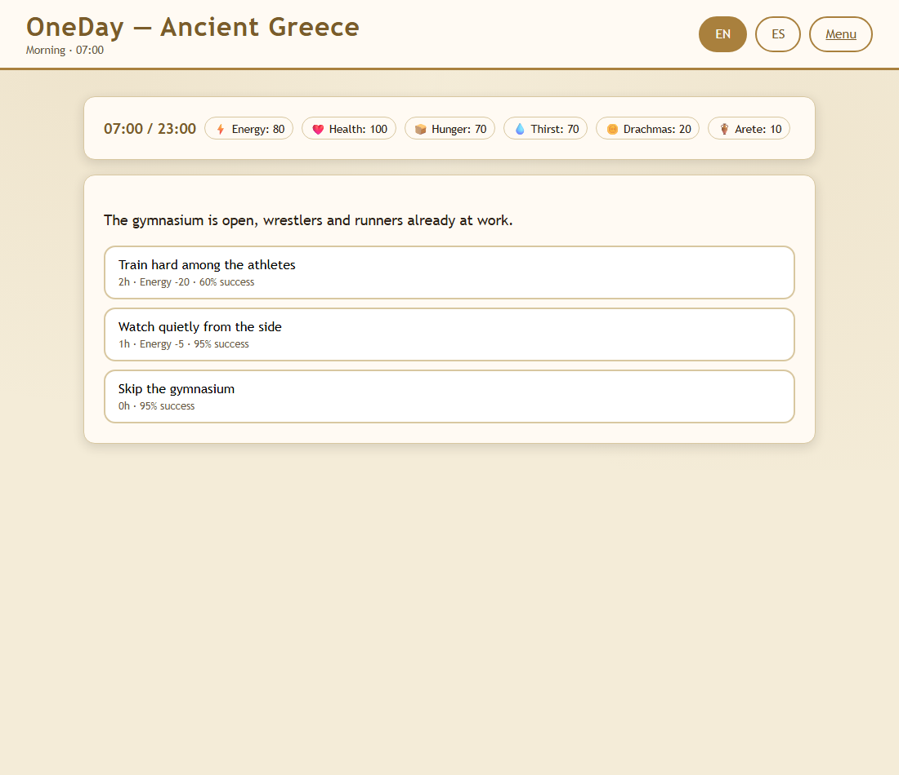
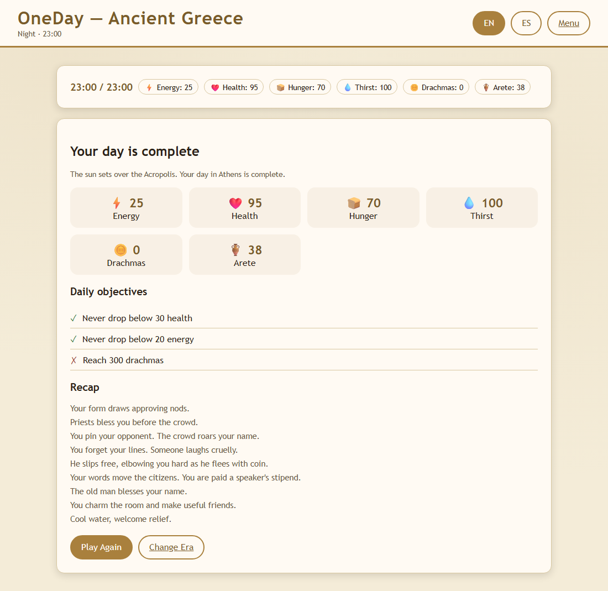

# OneDay

[](https://github.com/lucasmarjua-ui/oneday/actions/workflows/ci.yaml)
[](https://github.com/lucasmarjua-ui/oneday/actions/workflows/deploy.yaml)
[](LICENSE)
[](https://lucasmarjua-ui.github.io/oneday/)


OneDay is a data-driven decision game: pick an era, pick an archetype, customize a paper-doll character, then live a single day one decision card at a time. Every option costs time and resources and rolls against your archetype's strengths; the day ends when time runs out (a good ending) or a critical resource hits zero (a bad ending) — both with narrative text specific to the era. Built with HTML, CSS and vanilla JavaScript, no frameworks, no build step, fully bilingual (English/Spanish) from the first commit.

**[▶ Play now](https://lucasmarjua-ui.github.io/oneday/)**

## Play locally

No dependencies, no build step, nothing to install to play. The game uses native ES modules, so it needs to be served over `http://` rather than opened directly as a `file://` path (browser CORS rules block module imports from disk). Serve the repository root with any static server, for example:

```bash
python -m http.server 8000
```

Then visit `http://localhost:8000`. (A `package.json` exists only to mark the code as ES modules and to give the test suite a `npm test` command — there is nothing to `npm install`.)

## How to play

1. On the home screen, pick a language (EN/ES, top right) and an era. Only **Ancient Greece** is available at launch — the other cards are placeholders for future eras.
2. Choose an **archetype** — Warrior, Orator or Philosopher — which fixes your success-chance bonuses for the rest of the playthrough. No option is ever fully blocked by your archetype; it just makes some routes more reliable than others.
3. Customize your character's appearance: base look, outfit, headgear and an accessory, each just swapping a simple SVG layer (no hand-drawn art per combination).
4. Click **Begin the Day**. The day runs from 07:00 to 23:00 in a shared time budget; each decision costs a variable number of hours, so a full day is roughly 8-20 decisions depending on your choices.
5. Each decision card presents 2-4 options. Every option shows its time cost, resource cost, and success chance before you commit. Success and failure each have their own resource changes and narrative text, and some outcomes set flags that unlock or block later cards in the same day.
6. The day ends one of two ways, each with its own narrative closing: **time runs out** (a normal ending), or a critical resource (health) **hits zero** (a bad ending, with era-specific flavor text). The summary screen then shows your final resources, a checklist of the 3 objectives randomly picked for that playthrough, and a short recap of what happened.
7. Some titles are **meta-achievements**: they require accumulating a resource (like lifetime Arete) across multiple playthroughs of the same era, tracked on your profile once you log in.

## Architecture

```text
index.html                     Era selection, archetype choice, character appearance, login, profile
game.html                      The day loop: HUD, decision cards, outcomes, summary
shared/
  firebase-config.js           Firebase SDK initialization (client config, not a secret)
  auth.js                      Username/password auth + localStorage <-> Firestore sync
  era-registry.js              List of eras and loader for their era.json + cards.json
  rng.js                       Seeded PRNG (mulberry32) + seed generation (random and date-based)
  i18n.js                      Loads /data/i18n, tracks the chosen language, t()/localize() helpers
  resources.js                 Generic resource engine (create, apply deltas, clamp)
  day-engine.js                Time budget, current time-of-day slot, clock formatting
  character.js                 Paper-doll character creation, archetype selection, SVG render
  decision-engine.js           Card filtering by conditions/time slot, weighted pick, success rolls
  objectives.js                Daily objective pool selection and completion checks
  achievements.js              Cross-playthrough meta-progress and meta-achievement unlocks
  stats.js                     Per-era play statistics (days played, objectives completed)
  theme.css                    Shared visual theme, responsive layout
data/
  i18n/en.json, es.json        Fixed interface strings (buttons, menus, labels)
  eras/greece/era.json         Resources, archetypes, day structure, character options, objectives, endings
  eras/greece/cards.json       Decision cards for Ancient Greece (bilingual text throughout)
tests/*.test.js                Unit tests for the engine, run with Node's built-in test runner
firestore.rules                Firestore security rules (reference, pasted into the console)
.github/workflows/ci.yaml      Runs the test suite on every push and pull request
.github/workflows/deploy.yaml  Publishes the static site to GitHub Pages on every push to main
```

Adding a new era means adding a new `data/eras/<id>/` folder (`era.json` + `cards.json`) and registering it in `shared/era-registry.js` — the engine itself does not change.

## The decision engine

Each era is entirely defined by two JSON files: `era.json` (resources, archetypes, day length, character customization options, objective pool, meta-achievements, ending narration) and `cards.json` (an array of decision cards). Nothing about a specific era is hardcoded in `shared/`. Every player-facing string is a bilingual object (`{ "en": "...", "es": "..." }`) rather than a plain string — see [Internationalization](#internationalization) below.

A decision card looks like this:

```json
{
  "id": "greece-market-haggle",
  "text": { "en": "A merchant in the agora offers imported pottery at a steep price.", "es": "Un mercader del ágora ofrece cerámica importada a un precio elevado." },
  "timeSlots": ["midday", "afternoon"],
  "weight": 4,
  "conditions": { "resources": { "currency": { "min": 5 } } },
  "options": [
    {
      "id": "haggle",
      "text": { "en": "Try to haggle the price down", "es": "Intenta regatear el precio" },
      "cost": { "time": 1, "resources": { "currency": -5 } },
      "successChance": { "base": 0.5, "archetypeBonus": { "modifier": "charm", "scale": 0.05 } },
      "success": { "resources": { "currency": 15, "reputation": 1 }, "text": { "en": "The merchant relents, impressed by your wit.", "es": "El mercader cede, impresionado por tu ingenio." }, "flagsSet": ["haggled-once"] },
      "failure": { "resources": { "reputation": -1 }, "text": { "en": "The merchant scoffs and waves you off.", "es": "El mercader se burla y te despacha con la mano." } }
    }
  ]
}
```

At each step, `getValidCards` filters the deck by the current time-of-day slot, resource conditions and required/excluded flags from earlier choices that day, then `pickWeightedCard` picks one using each card's `weight` and a **seeded RNG** (so, for example, a market card is more likely at midday than at midnight). `computeSuccessChance` clamps `base + archetypeModifier * scale` to `[0.05, 0.95]`, and the roll's outcome applies its resource deltas and any flags it sets. This small combinatorial space — ~25 cards × conditions × weighted time slots × archetype-influenced rolls — produces a different playthrough almost every time without hand-writing every path.

## Archetypes

Character creation is a fixed choice, not a point-buy: pick one archetype, which sets fixed bonuses toward a shared skeleton of success-chance modifiers (`might`, `wits`, `charm`, and `luck` for eras that use it). Each era declares which modifiers it uses and defines 3-4 archetypes on top of them — same engine, different narrative dressing, exactly like resources. Ancient Greece uses three:

| Archetype | Modifier | Flavor |
|---|---|---|
| Warrior | `might` | Trained for combat and physical endurance. |
| Orator | `charm` | A persuasive voice in the agora and the assembly. |
| Philosopher | `wits` | Sharp-minded, favoring strategy over force. |

A card option references at most one modifier (`successChance.archetypeBonus.modifier`), so an archetype never fully locks a player out of a route — it just makes some options more or less reliable.

## Seeded RNG

`shared/rng.js` provides a `mulberry32`-based seeded PRNG. Every function in the engine that needs randomness (`pickWeightedCard`, `resolveOption`, `pickDailyObjectives`) takes an `rng` function as a **required** argument — nothing in the engine calls `Math.random()` directly. Each playthrough creates one RNG instance from a fresh random seed (`createRng(randomSeed())`) and threads it through the whole day, so a given seed with the same choices always reproduces the exact same playthrough (see `tests/greece-data.test.js` for a determinism test that plays two identical seeded runs and asserts identical card sequences and final resources).

This is what makes the planned **Daily Challenge** mode possible later without touching the engine: `dailySeed(eraId, date)` already exists and hashes a date + era id into a seed, so "today's challenge" for a given era can share the exact same card sequence and roll outcomes for every player, differing only by the choices they make. Free play just uses `randomSeed()` instead — same engine, different seed source.

## Internationalization

The interface and all content are bilingual (English/Spanish) from the first commit:

- Fixed interface strings (buttons, headings, form labels) live in `data/i18n/en.json` and `data/i18n/es.json`, loaded once and looked up with `t(key)` from `shared/i18n.js`.
- Every piece of content text inside `era.json` and `cards.json` — card and option text, outcomes, resource/archetype/slot labels, objective descriptions, achievement titles, ending narration — is an object `{ "en": "...", "es": "..." }` instead of a plain string, read with `localize(field)`.
- The language selector (EN/ES buttons in the header) persists the choice to `localStorage` and re-renders the current screen in place via `onLanguageChange`, without losing game state.
- Code, variable/function names, comments and this README stay in English, matching the rest of this portfolio — only player-facing text is bilingual.

## Meta-progress and achievements

Two separate layers of goals:

- **Daily objectives**: 3 are picked at random (via the seeded RNG) from the era's `objectivesPool` at the start of each playthrough (e.g. "reach 300 drachmas", "never drop below 30 health"), checked against the day's final state and shown as a checklist on the summary screen.
- **Meta-achievements**: persistent titles tied to the player's account, unlocked by accumulating a resource across multiple playthroughs of the same era (e.g. "Archon of Athens" at 500 lifetime Arete earned). Progress is stored locally under the `oneday.progress` key, synced (like the rest of a signed-in player's data) inside their `users/{uid}` Firestore document, and checked at the end of every day.

## Testing

The engine's rules (card filtering, weighted selection, success-chance math, objective checks, RNG determinism) are covered by unit tests using Node's built-in test runner — zero test-framework dependencies, consistent with the rest of the project. `tests/greece-data.test.js` also validates the real `era.json`/`cards.json` content directly: every field that should be bilingual actually is, every archetype bonus references a modifier the era declares, and a simulated day across 100 different seeds always terminates without throwing.

```bash
npm test
```

`.github/workflows/ci.yaml` runs this on every push and pull request.

## Accounts and progress (Firebase)

OneDay uses its own Firebase project, independent of any other project in this portfolio. It works fully as a guest with no account: character, progress and stats are saved to `localStorage`. Logging in creates or authenticates with a **username and password** (internally mapped to a generated email, `username@oneday.local` — a real email is never asked for or shown). On login, local progress is merged into the `users/{uid}` Firestore document and kept in sync from then on.

### Pending setup in the Firebase console

The `firebaseConfig` in [`shared/firebase-config.js`](shared/firebase-config.js) is a placeholder. Firestore and the email/password provider cannot be enabled through the API or CLI — Google requires a first manual click for each in the console:

1. Create a Firebase project (e.g. `oneday-game`) and a Web App inside it, then copy the resulting config values into `shared/firebase-config.js`.
2. **Firestore Database → Create database** (pick a region) — a single click, no further configuration needed.
3. **Authentication → Get started → Sign-in method → Email/Password → Enable**.
4. **Authentication → Settings → Authorized domains**: add `lucasmarjua-ui.github.io` so login also works on GitHub Pages (`localhost` is already authorized).
5. **Firestore Database → Rules**: paste the contents of [`firestore.rules`](firestore.rules) and publish.

Everything else — including guest play — works without these steps.

## Technical decisions

**No build step, no frameworks.** The whole project is HTML, CSS and vanilla JavaScript with native ES modules. GitHub Pages serves the repository as-is, and anyone can clone it and open it (behind a static server) without installing anything. `package.json` exists only to declare ES module semantics for Node's test runner and has zero dependencies.

**Procedural character art, no image assets.** The paper-doll character is drawn entirely as inline SVG primitives (`shared/character.js`), colored and shaped from each era's `era.json`. Adding a new era's wardrobe means adding shape/color entries to a config file, not commissioning or hand-editing art.

**Data-driven content, engine-agnostic of era.** All narrative content, resources, archetypes and character options live in per-era JSON. The engine only knows about generic concepts (resources, modifiers, time slots, flags), so a new era is pure content, no code changes.

**Seeded RNG as a first-class dependency, not an afterthought.** Every random draw takes an explicit `rng` argument; nothing falls back to `Math.random()`. This keeps playthroughs reproducible for debugging today and makes the Daily Challenge mode (same seed for every player on a given day) a content/UI feature to add later, not an engine rewrite.

## Screenshots

| | |
|---|---|
|  Era selection |  Archetype selection |
|  Character appearance |  A decision card mid-day |


End-of-day summary, with the era's own narrative ending

## Roadmap

**Daily Challenge mode**: a deterministic per-day, per-era seed (`dailySeed`, already implemented) so every player gets the same card sequence and roll outcomes on a given day, plus a daily leaderboard per era in Firestore alongside the existing free-play leaderboard. Grow the Ancient Greece card pool toward 40-60 cards; add the Futuristic City and Neanderthal eras (content only, same engine); add a dystopian city era; more meta-achievements per era; a proper "coming soon" state polish for locked eras.

## License

MIT. Copyright Lucas Martinez, 2026. See [LICENSE](LICENSE).
