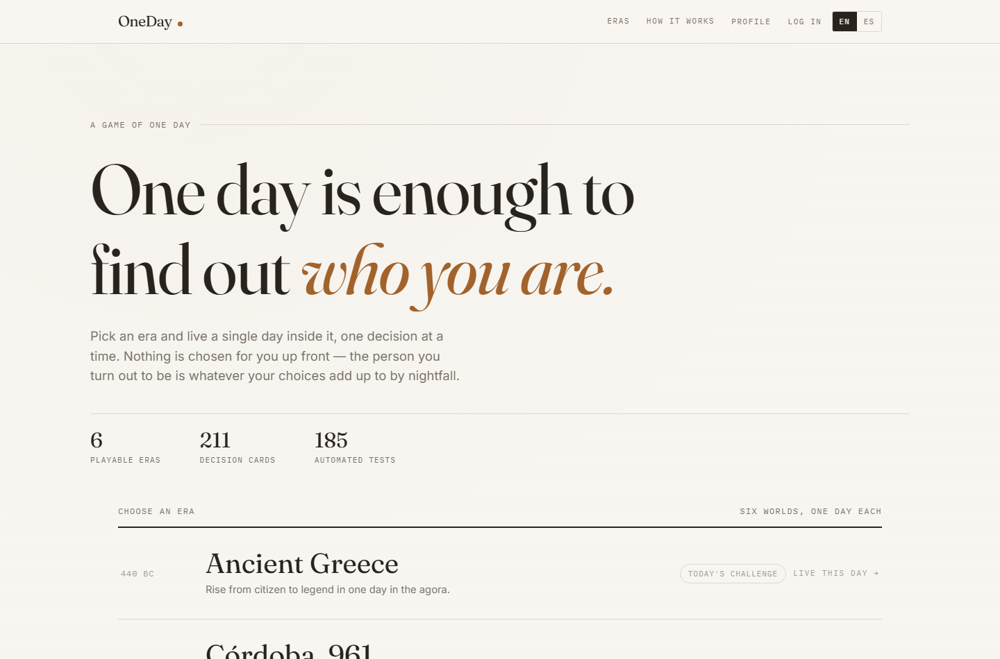
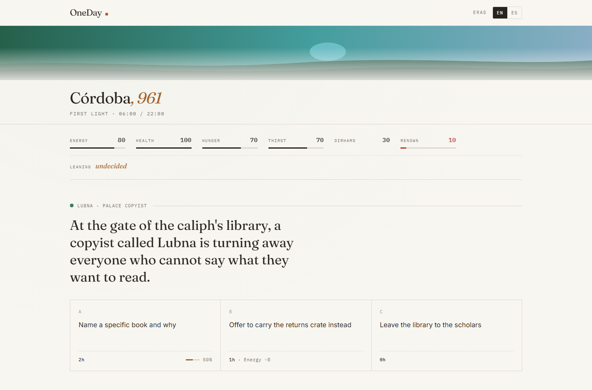
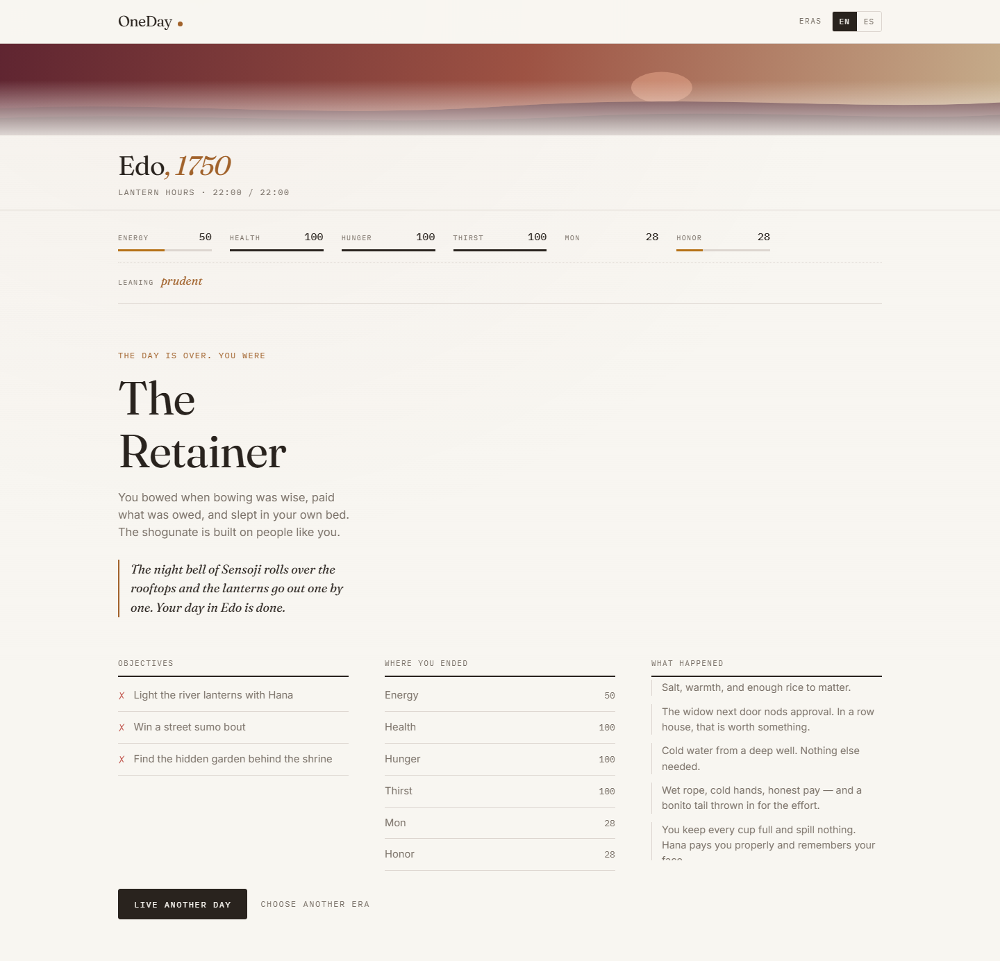

# OneDay

[](https://github.com/lucasmarjua-ui/oneday/actions/workflows/ci.yaml)
[](https://github.com/lucasmarjua-ui/oneday/actions/workflows/deploy.yaml)
[](LICENSE)
[](https://lucasmarjua-ui.github.io/oneday/)


OneDay is a data-driven decision game. Pick one of six eras, live a single day inside it one decision card at a time, and find out who that day turned you into. Every option costs hours and resources; the day ends when time runs out or a critical resource hits zero. There is no character creation and no class: **the person you end up being is read backwards from the choices you actually made.**

Built with HTML, CSS and vanilla JavaScript. No frameworks, no build step, no dependencies, fully bilingual (English/Spanish).

**[▶ Play now](https://lucasmarjua-ui.github.io/oneday/)**

## Play locally

Nothing to install. The game uses native ES modules, so it needs to be served over `http://` rather than opened as a `file://` path:

```bash
python -m http.server 8000
```

Then visit `http://localhost:8000`. (`package.json` exists only to mark the code as ES modules and to give the test suite an `npm test` command — there is nothing to `npm install`.)

## How to play

1. Pick an era from the index on the home page. That is the entire setup — you are in the day on the next click.
2. Each decision card offers 2-4 options. Every option shows what it costs in hours and resources, and its odds when it is a real gamble.
3. Your odds are shaped by the day itself: how much energy or standing you have left, and how consistently you have been making a certain *kind* of choice today.
4. The day ends when the clock runs out (a normal ending) or a critical resource bottoms out (a bad one, with era-specific narration).
5. The summary screen names you: **The Hoplite**, **The Almsgiver**, **The Fixer**, **The Sign-Reader**… whichever of the six traits your choices leaned into most. It also scores the three objectives that were drawn for that playthrough, lists where your resources ended, and recaps what happened.
6. Every era also has a **Today's Challenge**: a shared daily seed, one attempt per player per era per day, a same-day leaderboard, a streak, and a downloadable result card.

## Who you become: traits and personas

This is the core of the redesign, and the reason character creation was removed.

Every option in every card is tagged with exactly one of six **traits** — `bold`, `prudent`, `generous`, `cunning`, `diligent`, `curious`. Choosing it adds a point. Those points accumulate in `dayState.traits` over the day (the same accumulate-a-named-number helper that NPC attitude counters already used), and the HUD shows which one is currently ahead, so you can see your own drift in real time.

At day's end, `shared/persona.js`'s `resolvePersona` picks the era's persona for your highest trait. Each era declares one persona per trait plus a trait-less fallback for a day with no leaning at all, so a persona always resolves — that invariant is asserted for all six eras in `tests/era-data.test.js`, together with a check that every trait is actually reachable through that era's own cards (otherwise a persona would be unreachable content).

Traits also feed back into play *during* the day. An option's `successChance` can carry a `traitBonus`, which rewards you for consistency: a bold player finds the next bold gamble slightly more likely to pay off, capped so a one-note day can never buy certainty.

```json
"successChance": {
  "base": 0.45,
  "traitBonus": { "trait": "bold", "perPoint": 0.04 }
}
```

Traits are deliberately **not** persisted across playthroughs, even for signed-in players: `createDayState` always starts them empty. Who you were yesterday should not decide who you are today — only NPC memories carry over.

## The decision engine

Each era is defined by two JSON files: `era.json` (resources, day structure, cast, personas, objective pool, meta-achievements, endings) and `cards.json` (the decision cards). Nothing about a specific era is hardcoded in `shared/`.

```json
{
  "id": "edo-temple-bell",
  "npcId": "npc-tetsuo",
  "threadId": "tetsuo-thread",
  "text": { "en": "At Sensoji, the bell-ringer has thrown his back out…", "es": "En Sensoji, al campanero se le ha destrozado la espalda…" },
  "timeSlots": ["dawn", "morning"],
  "weight": 3,
  "conditions": { "flagsExcluded": ["met-tetsuo"] },
  "options": [
    {
      "id": "ring-the-bell",
      "text": { "en": "Swing the beam and ring the hour", "es": "Empuja la viga y tañe la hora" },
      "traits": { "diligent": 1 },
      "cost": { "time": 1, "resources": { "energy": -12 } },
      "successChance": { "base": 0.7, "resourceBonus": { "resource": "energy", "scale": 0.3 } },
      "success": { "resources": { "reputation": 5 }, "flagsSet": ["rang-temple-bell", "met-tetsuo"], "countersAdd": { "tetsuoFavor": 2 }, "text": { "en": "…", "es": "…" } },
      "failure": { "resources": { "reputation": -2 }, "text": { "en": "…", "es": "…" } }
    }
  ]
}
```

At each step `getValidCards` filters the deck by time-of-day slot, resource conditions, NPC counter thresholds and flags set earlier that day; `pickWeightedCard` draws one using a **seeded RNG**; `computeSuccessChance` combines the base chance with a `resourceBonus` and/or a `traitBonus`; the roll's outcome applies its resource deltas, flags and counters.

Two deliberate rules about odds:

- **A real roll is always clamped to `[0.05, 0.95]`** — nothing is ever a foregone conclusion.
- **An option with no bonus at all is not a roll.** "Walk past, 0h" is simply certain, and is shown with no odds. (Before the redesign the clamp was applied unconditionally, so certain options printed a misleading "95%".)

`resourceBonus` reads a bounded resource and swings the chance by up to ±scale/2 between empty and full, so being worn out genuinely makes the physical option riskier without ever locking it.

## Eras

Six worlds, one day each. Adding a seventh means two JSON files plus one registry entry — and it inherits the whole data test suite automatically.

| Era | When | Its own currency & flavor |
|---|---|---|
| **Ancient Greece** | 440 BC | Drachmas & Arete; agora, gymnasium, assembly, a hidden shrine |
| **Córdoba, 961** | 961 AD | Dirhams & Renown; the caliph's library, the souk, tanneries, a flooding Guadalquivir |
| **Edo, 1750** | 1750 | Mon & Honor; temple bell, fire watch, kabuki, a daimyo procession |
| **Neanderthals** | 50,000 BC | Provisions & Tribal Respect; a fused `survival` resource, the great hunt, the fire |
| **Futuristic City** | 2088 | Credits & Corporate Influence; gig deliveries, a rogue AI, a courier strike |
| **Mars Colony** | 2140 | Credits & Standing; **oxygen as a second critical resource**, EVAs, dust storms, a clinic |

Mars is the clearest proof the schema generalizes: it declares `oxygen` as a *second* `critical: true` resource, so a day can end by suffocation as easily as by injury, and the engine needed no changes for it — `isCriticalDepleted` already iterated whatever the era declared.

Each era has three recurring NPCs with their own multi-card threads and attitude counters, and declares which flags/counters are **memorable**, so a signed-in player's relationships carry into their next playthrough of that era (`shared/memories-logic.js`).

## Visual identity: the almanac

The previous design was a dark navy, glass-and-photography interface built around a full-screen cinematic hero. This redesign replaces it completely with something quieter and more editorial — **a printed almanac**:

- **Warm paper ground** (`hsl(40 36% 96%)`) with ink-dark type and a faint drawn grain, instead of dark glass panels.
- **Hairline rules and spacing carry the structure.** There are no cards-as-surfaces, no blur, no shadows except on modals. A decision's options are cells in a ruled grid.
- **Fraunces** for display, **IBM Plex Mono** for every number, label and cost readout, **Inter** for body copy. Numbers being monospaced is the whole reason the HUD reads like an instrument panel.
- **One accent hue per era**, declared in `shared/era-registry.js` and set as `--accent-h` on `<body data-era>`. It tints the wordmark dot, the era's name, the leaning indicator, card top-rules and the summary's verdict — so each world feels distinct without a second design system.
- **The home page is an index, not a hero.** Six ruled rows, each a year, a name and a tagline, filling with that era's own hue on hover. It is the table of contents of a book, and it is also the only navigation the game needs now that there is no character creation.

### Where the imagery went

There is no photography in the interface chrome any more. Each era gets a thin **horizon band** under the play screen's masthead instead of a full-page backdrop: for the three eras that ship a photograph (`assets/era-bg-*.jpg`) it is that photo, luminosity-blended and faded into the paper; for the three new eras `shared/atmosphere-bg.js` draws a generated horizon from the era's own accent hue — a low disc and two slowly drifting bands. Both paths render the same component, so a photo-backed era and a generated one sit side by side without looking like two different products.

**If you want photographs for Córdoba, Edo and Mars**, generate three images the same way as the existing ones and drop them in as `assets/era-bg-{cordoba,edo,mars}.jpg` — wiring them up is one line in `atmosphere-bg.js` (`PHOTO_ERAS`).

## Architecture

```text
index.html                     The era index, login and profile
game.html                      The day loop: HUD, decisions, outcomes, summary
shared/
  era-registry.js              The six eras: ids, names, years, accent hues, file paths
  persona.js                   Traits, trait ranking, and which persona a day resolves to
  decision-engine.js           Card filtering, weighted draw, success chance, roll resolution
  day-engine.js                Time budget, time-of-day slot, clock, day progress
  resources.js                 Generic resource engine (create, apply deltas, clamp, critical)
  objectives.js                Daily objective selection and completion checks
  narrative.js                 Accumulates named counters (NPC attitude, and traits)
  npc.js                       Looks up an era's NPC by id
  memories-logic.js            Pure cross-playthrough memory rules (seed, extract, merge)
  memories.js                  localStorage read/write for a signed-in player's memories
  achievements.js              Cross-playthrough meta-progress and unlocks
  stats.js                     Per-era play statistics
  scoring.js                   Pure Daily Challenge score formula
  daily-challenge-logic.js     Pure "already played today?" check
  daily-challenge.js           Daily Challenge cache + Firestore leaderboard
  resource-bar.js              Pure resource-bar math
  streaks-logic.js / streaks.js  Daily Challenge streak rules and storage
  atmosphere-bg.js             The per-era horizon band (photo or generated)
  share-card.js                The downloadable result card, drawn on <canvas>
  rng.js                       Seeded PRNG (mulberry32) + random/date-based seeds
  i18n.js                      Loads /data/i18n, tracks language, t()/localize()
  auth.js                      Username/password auth + localStorage <-> Firestore sync
  theme.css                    The whole almanac design system
data/
  i18n/en.json, es.json        Interface strings
  eras/<id>/era.json           Resources, day structure, NPCs, personas, objectives, endings
  eras/<id>/cards.json         That era's decision cards
tests/*.test.js                Node's built-in test runner, no test framework
```

## Testing

**187 tests**, zero test-framework dependencies, using Node's built-in test runner.

```bash
npm test
```

The engine's rules are covered directly (card filtering, weighted draw, both bonus types and their caps, the clamp/certainty rule, objective checks, RNG determinism, streak and memory rules, the scoring formula's invariants).

`tests/era-data.test.js` is the one that scales: it reads `shared/era-registry.js` and runs the **same twelve checks against every era**, so a new era inherits them by existing. Per era it asserts that every player-facing field is bilingual, that personas cover all six traits plus a fallback, that every option declares a valid trait, that every trait is actually reachable through that era's cards, that success bonuses only reference resources and traits that exist, that NPC/thread references resolve and chain, that every flag-based objective is reachable by some card, that declared memories are really produced, and that a simulated day terminates and stays deterministic across 60 seeds. It also checks globally that card ids are unique *across* eras and that eras use genuinely different resource sets rather than being reskins.

`tests/i18n.test.js` enforces the bilingual contract mechanically: both bundles must declare the same keys, no string may be empty, placeholders must match between languages, every `data-i18n` attribute and every `t()` lookup in both pages must resolve, and no key may be dead.

Firestore-touching code and `<canvas>` rendering are verified in a real browser rather than unit tested, as before.

## Daily Challenge

Each era's "Today's Challenge" plays the same engine seeded from `dailySeed(eraId, today)` instead of a random seed, so every player gets the identical card sequence, rolls and objective set that day; only their choices differ. One attempt per player per era per day, enforced locally by cache and server-side by `firestore.rules` allowing a `dailyLeaderboards/{eraId}-{date}/entries/{uid}` document to be **created but never updated or deleted**.

Scoring: 100 points per completed objective, plus a 0-10 tiebreak from final health and currency — capped well below one objective on purpose, so it can only rank players who completed the same number of objectives.

Finishing a challenge while signed in keeps one global **streak** alive across all eras, and offers a **downloadable result card**: a PNG drawn on `<canvas>` in the same almanac identity, headlined with the persona that day produced.

## Accounts and progress (Firebase)

The game is fully playable as a guest; progress lives in `localStorage`. Logging in uses a **username and password** (mapped internally to `username@oneday.local`; a real email is never requested), merges local progress into a `users/{uid}` Firestore document, and keeps it in sync. Account-gated features are cross-playthrough NPC memory, the streak, and leaderboard participation.

### One manual console step

**Authentication → Sign-in method → Email/Password → Enable**, then add `lucasmarjua-ui.github.io` to **Authorized domains**. Guest play — the whole game minus accounts and the leaderboard — works without it.

## Technical decisions

**No build step, no frameworks, no dependencies.** GitHub Pages serves the repository as-is.

**Data-driven content, engine-agnostic of era.** The engine only knows generic concepts — resources, traits, time slots, flags, counters — so a new era is content, not code. Mars adding a second critical resource required no engine change at all.

**Seeded RNG as a first-class dependency.** Every random draw takes an explicit `rng` argument; nothing calls `Math.random()`. That is what makes the Daily Challenge and the determinism tests possible.

**No art assets in the chrome.** The interface is type, rules and one accent hue. The only imagery is the per-era horizon band, and half of those are drawn in SVG from a hue.

**Every number shown on the site is real.** The era count is read from the registry at runtime; the card and test counts are the actual totals (211 decision cards across six eras, 187 tests).

## Known gaps

- **Email/Password sign-in is not enabled yet in the live Firebase project**, so on the live site every account-gated feature silently behaves like guest mode.
- **Three of the six eras have no background photograph** (Córdoba, Edo, Mars) and use the generated horizon band instead. See [Where the imagery went](#where-the-imagery-went).
- **No global all-time leaderboard for free play** — only the Daily Challenge has one.
- **No achievements showcase.** Meta-achievement progress is tracked and unlockable but there is no gallery view.

## License

MIT. Copyright Lucas Martinez, 2026. See [LICENSE](LICENSE).

## Screenshots


The home page is an index of the six eras, not a hero banner. Each row fills with that era's own accent hue.


A decision card in Córdoba, 961: paper, hairline rules, monospaced costs and odds, and a live "leaning" readout in the HUD.


The end of a day in Edo, 1750: the day names you before it shows you anything else.
