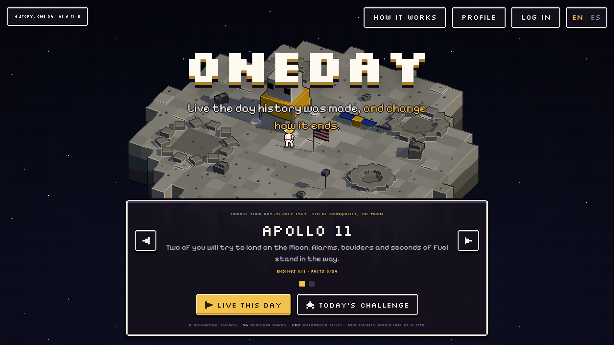
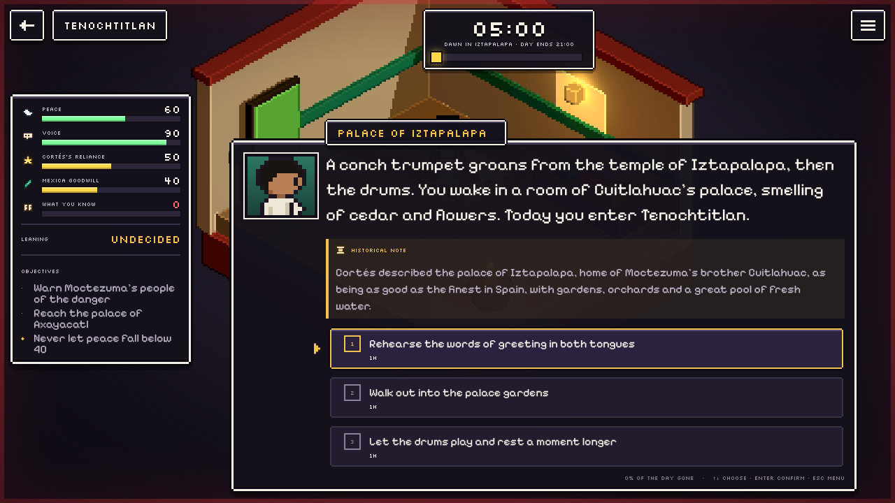
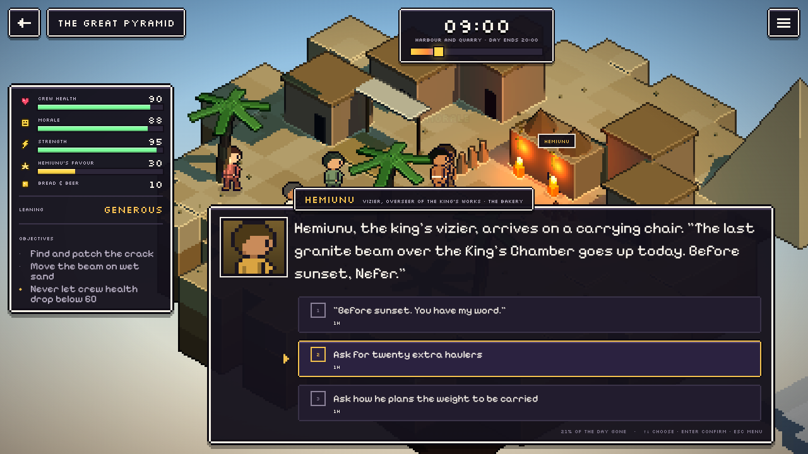
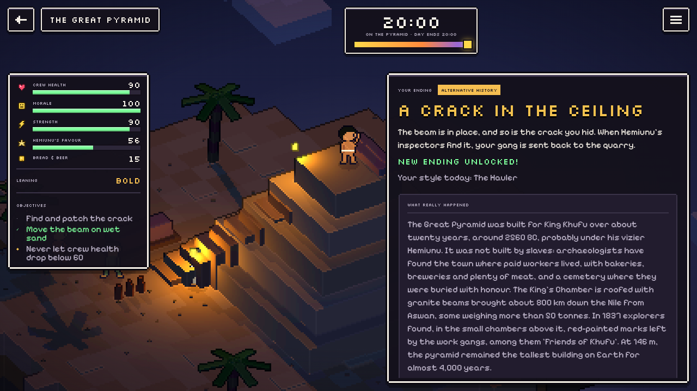
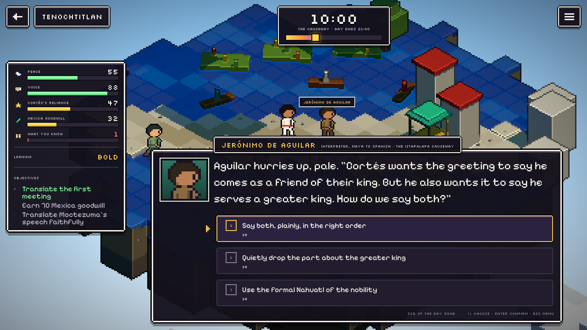
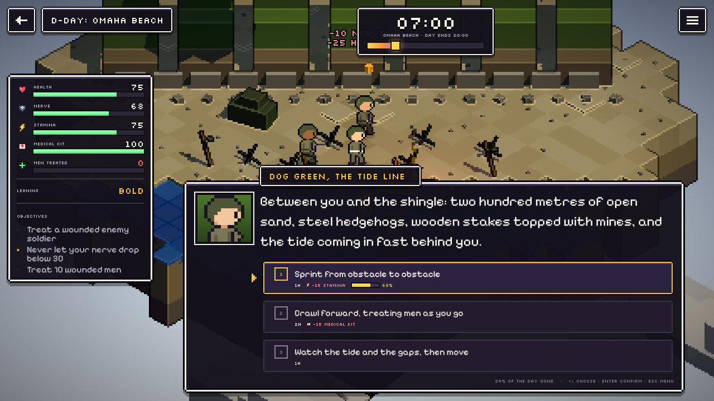

# OneDay

[](https://github.com/lucasmarjua-ui/oneday/actions/workflows/ci.yaml)
[](https://github.com/lucasmarjua-ui/oneday/actions/workflows/deploy.yaml)
[](LICENSE)
[](https://lucasmarjua-ui.github.io/oneday/)


OneDay is a historical decision game played on a **3D pixel-art stage**. Each event is **one real day from history, lived from inside**: you are Buzz Aldrin waking up in lunar orbit on 20 July 1969; Nefer, overseer of a work gang at Giza in 2560 BC, woken by a ram's horn on the day the last granite beam goes over the King's Chamber; Malintzin, the interpreter on whose words the meeting of Cortés and Moctezuma hangs in 1519; or a combat medic woken by the klaxon of a troopship off Omaha Beach on D-Day. Every day starts in your bedroom with the alarm ringing, then moves through the scenes of that day (a capsule, a lunar module, the Moon; a workers' town, a harbour, a quarry, the pyramid's ramp; a causeway across a lake into the Mexica capital; a landing craft, the beach, the bluffs). Every option costs hours and resources and is acted out on stage.

It is meant to **teach while you play**, like a historical novel: **every dialogue carries a historical note** about what really happened at that moment, and the end of the day tells you the real story. And history is not fixed: each event has **one historical ending and several alternative ones** (run out of fuel over the boulders, abort the landing, hide a cracked beam...), to be found and collected, along with every fact.

Built with HTML, CSS and vanilla JavaScript plus [three.js](https://threejs.org) (vendored, no CDN). No frameworks, no build step, fully bilingual (English/Spanish).

**[▶ Play now](https://lucasmarjua-ui.github.io/oneday/)**

## Screenshots

<table>
  <tr>
    <td width="50%"></td>
    <td width="50%"></td>
  </tr>
  <tr>
    <td><sub>The title screen: each event is a living diorama you flip through with ◂ ▸, with your endings and facts collected so far.</sub></td>
    <td><sub>Dawn in Iztapalapa, 1519. Every dialogue carries a historical note on what really happened there.</sub></td>
  </tr>
  <tr>
    <td></td>
    <td></td>
  </tr>
  <tr>
    <td><sub>The workers' town at Giza: the vizier Hemiunu brings the day's orders. Today's objectives are tracked live on the left.</sub></td>
    <td><sub>Nightfall on the pyramid: one of seven endings, the real story behind the day, and your collection.</sub></td>
  </tr>
  <tr>
    <td></td>
    <td></td>
  </tr>
  <tr>
    <td><sub>Tenochtitlan, 1519: on the causeway with Aguilar, between canoes and chinampas, deciding how to translate Cortés's greeting.</sub></td>
    <td><sub>Omaha Beach, 1944: hedgehogs, mined stakes and the shingle ahead, the tide coming in behind.</sub></td>
  </tr>
</table>

## Contents

- [Play locally](#play-locally)
- [How to play](#how-to-play)
- [Who you become: traits and personas](#who-you-become-traits-and-personas)
- [The decision engine](#the-decision-engine)
- [Historical events](#historical-events)
- [The stage: a 3D pixel-art diorama](#the-stage-a-3d-pixel-art-diorama)
- [Architecture](#architecture)
- [Testing](#testing)
- [Daily Challenge](#daily-challenge)
- [Accounts and progress (Firebase)](#accounts-and-progress-firebase)
- [Technical decisions](#technical-decisions)
- [Known gaps](#known-gaps)

## Play locally

Nothing to install. The game uses native ES modules, so it needs to be served over `http://` rather than opened as a `file://` path:

```bash
python -m http.server 8000
```

Then visit `http://localhost:8000`. (`package.json` exists only to mark the code as ES modules and to give the test suite an `npm test` command — there is nothing to `npm install`.)

To rebuild the 3D models (optional; the exported GLBs are committed):

```bash
pip install bpy            # Blender as a Python module
python tools/blender/character.py
python tools/blender/props.py
```

## How to play

1. Flip through the events on the title screen (◂ ▸ or the arrow keys) and press **Live this day**.
2. A **briefing** tells you the date, the place, who you are, and the three objectives drawn for this playthrough.
3. The day always opens **at home, with the alarm going off**: the stage flashes and beeps until you act. From there your character walks, scene by scene, to wherever each card happens. Each card offers 2-4 options (click, or the keys **1-4**), each showing what it costs in hours and resources and its odds when it is a real gamble.
4. Every dialogue comes with a **historical note**: the real history behind the moment you are living. Your character, modelled and animated in Blender, **acts out exactly what you chose** (drinks, writes, bandages, hauls a rope, prays, climbs, swims...), and objectives tick off live in the HUD with a fanfare when completed.
5. The day ends when the clock runs out or a critical resource bottoms out. The summary shows **your ending** (marked *as it really happened* or *alternative history*), **what really happened** that day, the facts you learned, and your **collection**: endings found and facts learned for that event, kept between playthroughs.
6. Every event also has a **Today's Challenge**: a shared daily seed, one attempt per player per day, a leaderboard, a streak and a downloadable result card.

## Who you become: traits and personas

This is the core of the redesign, and the reason character creation was removed.

Every option in every card is tagged with exactly one of six **traits** — `bold`, `prudent`, `generous`, `cunning`, `diligent`, `curious`. Choosing it adds a point. Those points accumulate in `dayState.traits` over the day (the same accumulate-a-named-number helper that NPC attitude counters already used), and the HUD shows which one is currently ahead, so you can see your own drift in real time.

At day's end, `shared/persona.js`'s `resolvePersona` picks the era's persona for your highest trait. Each event declares one persona per trait plus a trait-less fallback for a day with no leaning at all, so a persona always resolves — that invariant is asserted for every event in `tests/era-data.test.js`, together with a check that every trait is actually reachable through that era's own cards (otherwise a persona would be unreachable content).

Traits also feed back into play *during* the day. An option's `successChance` can carry a `traitBonus`, which rewards you for consistency: a bold player finds the next bold gamble slightly more likely to pay off, capped so a one-note day can never buy certainty.

```json
"successChance": {
  "base": 0.45,
  "traitBonus": { "trait": "bold", "perPoint": 0.04 }
}
```

Traits are deliberately **not** persisted across playthroughs, even for signed-in players: `createDayState` always starts them empty. Who you were yesterday should not decide who you are today — only NPC memories carry over.

## The decision engine

Each era is defined by two JSON files: `era.json` (resources, day structure, cast, personas, objective pool, meta-achievements, endings) and `cards.json` (the decision cards). Nothing about a specific era is hardcoded in `shared/`.

```json
{
  "id": "edo-temple-bell",
  "npcId": "npc-tetsuo",
  "threadId": "tetsuo-thread",
  "text": { "en": "At Sensoji, the bell-ringer has thrown his back out…", "es": "En Sensoji, al campanero se le ha destrozado la espalda…" },
  "timeSlots": ["dawn", "morning"],
  "weight": 3,
  "conditions": { "flagsExcluded": ["met-tetsuo"] },
  "options": [
    {
      "id": "ring-the-bell",
      "text": { "en": "Swing the beam and ring the hour", "es": "Empuja la viga y tañe la hora" },
      "traits": { "diligent": 1 },
      "cost": { "time": 1, "resources": { "energy": -12 } },
      "successChance": { "base": 0.7, "resourceBonus": { "resource": "energy", "scale": 0.3 } },
      "success": { "resources": { "reputation": 5 }, "flagsSet": ["rang-temple-bell", "met-tetsuo"], "countersAdd": { "tetsuoFavor": 2 }, "text": { "en": "…", "es": "…" } },
      "failure": { "resources": { "reputation": -2 }, "text": { "en": "…", "es": "…" } }
    }
  ]
}
```

At each step `getValidCards` filters the deck by time-of-day slot, resource conditions, NPC counter thresholds and flags set earlier that day; `pickWeightedCard` draws one using a **seeded RNG**; `computeSuccessChance` combines the base chance with a `resourceBonus` and/or a `traitBonus`; the roll's outcome applies its resource deltas, flags and counters.

Two deliberate rules about odds:

- **A real roll is always clamped to `[0.05, 0.95]`** — nothing is ever a foregone conclusion.
- **An option with no bonus at all is not a roll.** "Walk past, 0h" is simply certain, and is shown with no odds. (Before the redesign the clamp was applied unconditionally, so certain options printed a misleading "95%".)

`resourceBonus` reads a bounded resource and swings the chance by up to ±scale/2 between empty and full, so being worn out genuinely makes the physical option riskier without ever locking it.

## Historical events

Events are added **one at a time**, each researched and written as a whole: a day structure, a cast, 20-35 cards, endings and a scene set.

| Event | When & where | You are | Endings |
|---|---|---|---|
| **Apollo 11** | 20 July 1969, the Sea of Tranquility | Buzz Aldrin, Lunar Module Pilot | 8: the real landing at Tranquility Base, plus running out of fuel, losing oxygen, aborting, landing in West crater... |
| **The Great Pyramid** | c. 2560 BC, Giza | Nefer, overseer of the "Friends of Khufu" gang | 7: the gang's name painted over the King's Chamber, plus a hidden crack, a walk-off, a tomb of your own... |
| **Tenochtitlan** | 8 November 1519, Lake Texcoco | Malintzin, the interpreter between Cortés and Moctezuma | 6: the Spaniards lodged as guests in Axayacatl's palace, plus turning back, an honest peace, Moctezuma seized the same night, bloodshed on the causeway... |
| **D-Day: Omaha Beach** | 6 June 1944, Normandy | Ray Novak, a combat medic of the 116th Infantry | 6: a toehold on the bluffs by nightfall, plus being swamped offshore, wounded, pinned at the shingle, a medal... |

How an event is put together (`data/eras/<id>/`):

- **`era.json`** declares the resources (fuel and oxygen are both *critical* on the Moon; crew health and morale at Giza), the day's time slots, the opening card, the cast, personas, objectives, the `role` and `history` texts, and the **endings**. An ending has a `when` (`depleted` resource, `flagsRequired`, `flagsExcluded`, `resources`, `counters`); `shared/endings.js` picks the first that holds, exactly one is `historical`, and the last is a catch-all.
- **`cards.json`**: the key story beats (undocking, the 1202 alarm, the boulder field, the first step; the sledge, the ramp, setting the beam) carry a high weight and are chained by flags, so the day follows history unless your choices break the chain. Every card carries a `fact`, the historical note shown in the dialogue, and every option an `act`, what the character physically does.
- **Collections** (`shared/progress-logic.js`, stored by `shared/progress.js`) remember the endings and facts each player has found per event.

## The stage: a 3D pixel-art diorama

Every event is told across **several scenes**, each its own diorama (`shared/stage/worlds.js`): cut-away **rooms** (Columbia's cabin with its couches, consoles and a floating pen; Eagle's cramped cockpit with the guidance computer; a mud-brick house at Giza; a painted hall in Cuitlahuac's palace and the palace of Axayacatl; a troopship's hold with bunks five high) and floating voxel **islands** (the grey lunar surface with the gold-foil lander, the flag, the experiments and the Earth in a black sky; the workers' town with its bakery ovens; the harbour basin with the granite barge; the quarry terraces; the stepped pyramid with a mud-brick ramp the character actually climbs; the Iztapalapa causeway between floating gardens and canoes, with Moctezuma's feathered canopy at Xoloc; Tenochtitlan's streets under the twin shrines of the Templo Mayor; a landing craft pitching in the Channel; Omaha's hedgehogs, shingle and bluffs; hedgerows and an aid station above the beach). The stage fades between scenes as the day moves on, the outfit changes (a helmet with a gold visor on the Moon), crewmates stand in the cabin, crowds of workers mill about, and anyone not physically there speaks as a voice (Houston on the radio).

**How it is made to look like hand-placed pixel art** (`shared/stage/stage.js`):

- **One sprite texel is one render pixel.** The world is drawn at 16 pixels per unit, and the render is upscaled by a *whole* number of device pixels (aware of `devicePixelRatio`), so every pixel on screen is the same size, on a laptop or a 3x phone.
- **The camera snaps to the pixel grid**, so the world never shimmers as the camera follows the character.
- **A post pass inks the scene**: dark outlines where the depth buffer jumps (silhouettes) and light rims where the normal buffer turns (convex edges), then a colour grade (saturation, contrast, warm highlights, cool shadows).
- **Clouds cast shadows without hiding anything**: over the island they are invisible shadow-casters, so patches of shade sweep across the ground; visible clouds drift around the edge of the view.
- **Text is never a texture.** Floating resource changes and NPC name tags are browser text positioned over the canvas, so they stay sharp at any size.

- **The character and the props are modelled in Blender** (`tools/blender/`, run headless with the `bpy` module). The character is a low-poly figure with rigid parts on a skeleton and **30 animations** keyframed in code: idle, walk, run, sit, sleep, crouch, give, pick up, hammer, haul, push, inspect, point, talk, cheer, stumble, wave, drink, write, treat a wound, carry, climb, swim, pray, bow, think, salute, look out, dig and nod. Its materials are recoloured per event and its accessories switched on per outfit (`shared/stage/looks.js`): a spacesuit, helmet and gold visor on the Moon, a linen kilt at Giza, a huipil skirt for Malintzin, Moctezuma's feathers and mantle, Cortés's morion, a medic's armband and steel helmet on Omaha. The props are 16 models (the lunar module, palms, Nile boats, a sledge, dugout canoes, the Templo Mayor, Moctezuma's litter, a Higgins boat, steel hedgehogs, a Sherman, a destroyer, a bunker...). Events can have their own set too: **Apollo 11's** (`tools/blender/apollo.py`, `assets/models/apollo-11.glb`) has Columbia's cabin cut away (three couches before the main display console with its DSKY, attitude balls and caution lights), Eagle's cockpit (triangular windows, the circuit-breaker wall, the ascent engine cover), and on the surface craters, boulders, the seismometer and laser reflector Apollo 11 left behind, the solar-wind sheet, the TV camera and the Earth. **Giza's** (`tools/blender/giza.py`) follows the archaeology of the workers' town: a worker's house with its mud bench, hearth and quern, mud-brick houses with palm-log roofs, a bakery with bell-shaped bread moulds over embers, granaries, the Wall of the Crow, a cargo barge carrying a granite beam, papyrus, a quarry with blocks half freed by trenches and copper tools, and the unfinished pyramid with its casing stones and the King's Chamber beams. `tools/blender/preview.html` shows every clip and prop side by side.
- **Nobody walks through anything.** `shared/stage/nav.js` rasterises each scene into a grid: the ground is open, water and every solid prop (grown by a character's radius) are closed, and characters walk A* paths straightened wherever a line is clear. The player, NPCs and the crowds all path around boats, walls, hedgehogs and palm trunks.
- **Cards happen somewhere.** `shared/stage/places.js` gives each event its scenes and 5-7 places; a card goes to the place its id names (`first-step`, `sledge`, `tia`), or failing that to a place picked by a stable hash; each place belongs to a scene. The character walks there (up ramps too) and the NPC is waiting, or speaks over the radio.
- **Every choice is acted out as written.** Each option names what the character does (`act`), from 27 actions, with hand props where they help: a cup to drink, a tablet to write, a hammer to work (with sparks), a bandage to treat, a rope to haul. Options without one fall back to their trait's body language. A real gamble then gets a cheer and confetti or a stumble and a dust cloud; a sure thing gets a nod. Resource changes float up over the character's head.
- **The day passes on screen.** The sun travels across the sky with the clock and the light warms, fades and turns blue; lamps, lanterns and windows switch on as night falls. In space the sky stays black all day. Low vitals desaturate the world and pulses a red vignette.
- **It is a game, not a page.**
  - A boot sequence: a studio card, a loading bar and pixel-wipe transitions between screens (`shared/ui/screens.js`).
  - A pixel HUD with drawn resource icons (`shared/ui/icons.js`), 9-slice frames with notched corners, and two pixel fonts used only at sizes where their pixels land on whole screen pixels (Silkscreen at multiples of 8 px, Pixelify Sans at 16 and 24 px).
  - A dialog box with a name plate, a portrait and typewriter text; choices are picked with the arrow keys and Enter (or 1-4, or a click), with a cursor.
  - Title cards when the day moves into a new part ("Midday", "Night"), and an end-of-day cinematic: letterbox bars, the name the day gave you, then the results panel while the camera circles the character.
  - A pause menu (Esc) with music, sound effects, text speed and language, remembered between visits (`shared/ui/settings.js`).
  - Generative chiptune music with its own mode, tempo and progression for each era, which darkens as night falls (`shared/stage/music.js`), plus synthesised sound effects, footsteps included (`shared/stage/sfx.js`). Nothing is pre-recorded.

The rules never wait on the stage: every stage call has a timeout, and if WebGL or the module is unavailable the game falls back to the same HUD and dialog over a plain backdrop. Reduced-motion players get instant moves and no particles.

## Architecture

```text
index.html                     Title screen: event picker over a live diorama, collections, login, profile
game.html                      The day: briefing, stage, HUD, dialog, outcomes with notes, endings
shared/
  era-registry.js              The events: ids, names, dates, places, accent hues, file paths
  endings.js                   Which ending a day reaches
  progress-logic.js / progress.js  Collected endings and facts per event
  persona.js                   Traits, trait ranking, and which persona a day resolves to
  decision-engine.js           Card filtering, weighted draw, success chance, roll resolution
  day-engine.js                Time budget, time-of-day slot, clock, day progress
  resources.js                 Generic resource engine (create, apply deltas, clamp, critical)
  objectives.js                Daily objective selection and completion checks
  narrative.js                 Accumulates named counters (NPC attitude, and traits)
  npc.js                       Looks up an era's NPC by id
  memories-logic.js            Pure cross-playthrough memory rules (seed, extract, merge)
  memories.js                  localStorage read/write for a signed-in player's memories
  achievements.js              Cross-playthrough meta-progress and unlocks
  stats.js                     Per-era play statistics
  scoring.js                   Pure Daily Challenge score formula
  daily-challenge-logic.js     Pure "already played today?" check
  daily-challenge.js           Daily Challenge cache + Firestore leaderboard
  resource-bar.js              Pure resource-bar math
  streaks-logic.js / streaks.js  Daily Challenge streak rules and storage
  share-card.js                The downloadable result card, drawn on <canvas>
  rng.js                       Seeded PRNG (mulberry32) + random/date-based seeds
  i18n.js                      Loads /data/i18n, tracks language, t()/localize()
  auth.js                      Username/password auth + localStorage <-> Firestore sync
  game.css                     The game interface: pixel panels, HUD, dialog, title screen
  stage/stage.js               three.js stage: pixel rendering, camera, day cycle, actors, effects
  stage/worlds.js              The scene dioramas of every event
  stage/sprites.js             Event palettes and the pixel portraits of the dialog box (pure)
  stage/looks.js               How the 3D character dresses per event, scene and NPC (pure)
  stage/nav.js                 Collision grid and A* pathfinding (pure)
  stage/places.js              Each event's scenes, places, cast, and which card plays where (pure)
  stage/direction.js           Trait -> action, outcome -> reaction, sky colours by time (pure)
  stage/sfx.js                 WebAudio sound effects and the shared audio context
  stage/music.js               Generative per-era chiptune music
  ui/icons.js                  Pixel-art interface and resource icons as crisp SVG (pure)
  ui/settings.js               Music, sound and text-speed settings (persisted)
  ui/screens.js                Pixel-wipe transitions and the loading bar
vendor/three/                  three.js r169 and its GLTFLoader, MIT
assets/models/                 character.glb and props.glb, exported from Blender
tools/blender/                 character.py and props.py (headless Blender scripts), preview.html
data/
  i18n/en.json, es.json        Interface strings
  eras/<id>/era.json           Resources, day structure, NPCs, personas, objectives, endings
  eras/<id>/cards.json         That era's decision cards
tests/*.test.js                Node's built-in test runner, no test framework
```

## Testing

**219 tests**, zero test-framework dependencies, using Node's built-in test runner.

```bash
npm test
```

The engine's rules are covered directly (card filtering, weighted draw, both bonus types and their caps, the clamp/certainty rule, objective checks, RNG determinism, streak and memory rules, the scoring formula's invariants).

`tests/era-data.test.js` is the one that scales: it reads `shared/era-registry.js` and runs the **same checks against every event**, so a new event inherits them by existing. Per era it asserts that every player-facing field is bilingual, that personas cover all six traits plus a fallback, that every option declares a valid trait, that every trait is actually reachable through that era's cards, that success bonuses only reference resources and traits that exist, that NPC/thread references resolve and chain, that every flag-based objective is reachable by some card, that declared memories are really produced, and that a simulated day terminates and stays deterministic across 60 seeds. Per event it also checks the endings: exactly one historical ending, a catch-all last, an ending for every critical resource, every flag an ending needs set by some card, the historical ending reached and at least four different endings across 400 simulated days, a historical note on every single card, and a valid opening card. It also checks globally that card ids are unique *across* eras and that eras use genuinely different resource sets rather than being reskins.

`tests/stage.test.js` covers the stage's pure layer for every event: every sprite pose is a full frame with a colour for every pixel in every palette, every card lands on a real place in a real scene (and always the same one), every day opens indoors on an alarm, every NPC is on stage or a voice, every option maps to a known action, and the day ends in night on Earth but never in space.

`tests/ui.test.js` checks that every resource of every era has its own HUD icon, that icons are drawn at whole-pixel scales, and that settings default sensibly.

`tests/i18n.test.js` enforces the bilingual contract mechanically: both bundles must declare the same keys, no string may be empty, placeholders must match between languages, every `data-i18n` attribute and every `t()` lookup in both pages must resolve, and no key may be dead.

Firestore-touching code, `<canvas>` rendering and the WebGL stage are verified in a real browser rather than unit tested.

## Daily Challenge

Each era's "Today's Challenge" plays the same engine seeded from `dailySeed(eraId, today)` instead of a random seed, so every player gets the identical card sequence, rolls and objective set that day; only their choices differ. One attempt per player per era per day, enforced locally by cache and server-side by `firestore.rules` allowing a `dailyLeaderboards/{eraId}-{date}/entries/{uid}` document to be **created but never updated or deleted**.

Scoring: 100 points per completed objective, plus a 0-10 tiebreak from final health and currency — capped well below one objective on purpose, so it can only rank players who completed the same number of objectives.

Finishing a challenge while signed in keeps one global **streak** alive across all events, and offers a **downloadable result card**: a PNG drawn on `<canvas>`, headlined with the ending that day reached.

## Accounts and progress (Firebase)

The game is fully playable as a guest; progress lives in `localStorage`. Logging in uses a **username and password** (mapped internally to `username@oneday.local`; a real email is never requested), merges local progress into a `users/{uid}` Firestore document, and keeps it in sync. Account-gated features are cross-playthrough NPC memory, the streak, and leaderboard participation.

The Firebase SDK is loaded from Google's CDN with a dynamic `import()` (see `shared/firebase-config.js`), never a static one. If the CDN is blocked by an ad blocker, a corporate proxy or a lost connection, the game still loads and plays as a guest; only accounts, cloud sync and leaderboards are switched off.

### One manual console step

**Authentication → Sign-in method → Email/Password → Enable**, then add `lucasmarjua-ui.github.io` to **Authorized domains**. Guest play — the whole game minus accounts and the leaderboard — works without it.

## Technical decisions

**No build step, no frameworks.** GitHub Pages serves the repository as-is. The one library, three.js, is vendored as a single ES module in `vendor/three/`, so the game never depends on a CDN being up.

**Blender as code.** The character and props are built by Python scripts run against Blender's `bpy` module, so every model and animation is reproducible, reviewable in a diff and regenerated with one command. Tests read the exported GLBs directly: every action has a clip, every accessory a node, every prop the scenes place a model.

**Data-driven content, engine-agnostic of event.** The engine only knows generic concepts — resources, traits, time slots, flags, counters — so a new event is content (plus its scenes), not engine code.

**Seeded RNG as a first-class dependency.** Every random draw takes an explicit `rng` argument; nothing calls `Math.random()`. That is what makes the Daily Challenge and the determinism tests possible.

**Every number shown on the site is real.** The era count is read from the registry at runtime; the card and test counts are the actual totals (108 decision cards across four events, 219 tests).

## Known gaps

- **Email/Password sign-in is not enabled yet in the live Firebase project**, so on the live site every account-gated feature silently behaves like guest mode.
- **Characters do not collide with each other.** They path around the scenery, but crowds can overlap one another.
- **Four events so far.** More (the fall of the Berlin Wall, Columbus in 1492...) will be added one at a time.
- **The downloadable result card still uses the previous print design**, not the pixel style.
- **No global all-time leaderboard for free play** — only the Daily Challenge has one.
- **No achievements showcase.** Meta-achievement progress is tracked and unlockable but there is no gallery view.

## License

MIT. Copyright Lucas Martinez, 2026. See [LICENSE](LICENSE).
