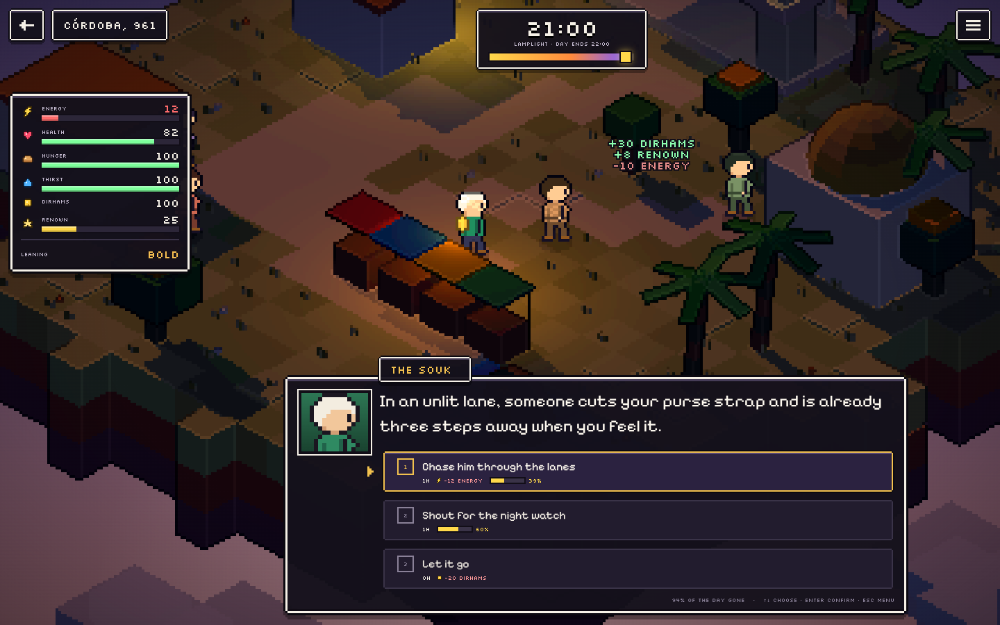
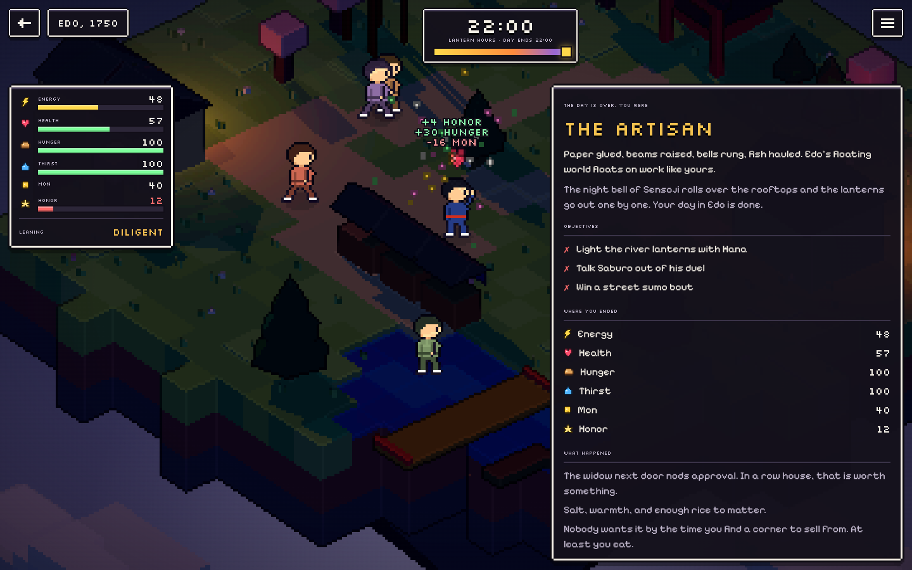

# OneDay

[](https://github.com/lucasmarjua-ui/oneday/actions/workflows/ci.yaml)
[](https://github.com/lucasmarjua-ui/oneday/actions/workflows/deploy.yaml)
[](LICENSE)
[](https://lucasmarjua-ui.github.io/oneday/)


OneDay is a data-driven decision game played on a **3D pixel-art stage**. Pick one of six eras, live a single day inside it one decision card at a time, and watch your character walk to the agora, the temple or the airlock, act out every choice and react to how it went, while the sun crosses the sky. At nightfall the game tells you who that day turned you into. Every option costs hours and resources; the day ends when time runs out or a critical resource hits zero. There is no character creation and no class: **the person you end up being is read backwards from the choices you actually made.**

Built with HTML, CSS and vanilla JavaScript plus [three.js](https://threejs.org) (vendored, no CDN). No frameworks, no build step, fully bilingual (English/Spanish).

**[▶ Play now](https://lucasmarjua-ui.github.io/oneday/)**

## Screenshots

<table>
  <tr>
    <td width="33%"></td>
    <td width="33%"></td>
    <td width="33%"></td>
  </tr>
  <tr>
    <td><sub>The title screen: each era is a living diorama you flip through with ◂ ▸.</sub></td>
    <td><sub>Meeting Yusuf in the souk. Costs and odds on every choice, resource changes float over your head.</sub></td>
    <td><sub>Lantern hours in Edo: the day names you while the camera circles your character.</sub></td>
  </tr>
</table>

## Contents

- [Play locally](#play-locally)
- [How to play](#how-to-play)
- [Who you become: traits and personas](#who-you-become-traits-and-personas)
- [The decision engine](#the-decision-engine)
- [Eras](#eras)
- [The stage: a 3D pixel-art diorama](#the-stage-a-3d-pixel-art-diorama)
- [Architecture](#architecture)
- [Testing](#testing)
- [Daily Challenge](#daily-challenge)
- [Accounts and progress (Firebase)](#accounts-and-progress-firebase)
- [Technical decisions](#technical-decisions)
- [Known gaps](#known-gaps)

## Play locally

Nothing to install. The game uses native ES modules, so it needs to be served over `http://` rather than opened as a `file://` path:

```bash
python -m http.server 8000
```

Then visit `http://localhost:8000`. (`package.json` exists only to mark the code as ES modules and to give the test suite an `npm test` command — there is nothing to `npm install`.)

## How to play

1. Flip through the eras on the title screen (◂ ▸ or the arrow keys) and press **Live this day**. That is the entire setup.
2. Your character walks to where the card happens and the dialog box types it out (Enter skips). Each card offers 2-4 options, picked with a click or the keys **1-4**. Every option shows what it costs in hours and resources, and its odds when it is a real gamble.
3. Your odds are shaped by the day itself: how much energy or standing you have left, and how consistently you have been making a certain *kind* of choice today.
4. The day ends when the clock runs out (a normal ending) or a critical resource bottoms out (a bad one, with era-specific narration).
5. The summary screen names you: **The Hoplite**, **The Almsgiver**, **The Fixer**, **The Sign-Reader**… whichever of the six traits your choices leaned into most. It also scores the three objectives that were drawn for that playthrough, lists where your resources ended, and recaps what happened.
6. Every era also has a **Today's Challenge**: a shared daily seed, one attempt per player per era per day, a same-day leaderboard, a streak, and a downloadable result card.

## Who you become: traits and personas

This is the core of the redesign, and the reason character creation was removed.

Every option in every card is tagged with exactly one of six **traits** — `bold`, `prudent`, `generous`, `cunning`, `diligent`, `curious`. Choosing it adds a point. Those points accumulate in `dayState.traits` over the day (the same accumulate-a-named-number helper that NPC attitude counters already used), and the HUD shows which one is currently ahead, so you can see your own drift in real time.

At day's end, `shared/persona.js`'s `resolvePersona` picks the era's persona for your highest trait. Each era declares one persona per trait plus a trait-less fallback for a day with no leaning at all, so a persona always resolves — that invariant is asserted for all six eras in `tests/era-data.test.js`, together with a check that every trait is actually reachable through that era's own cards (otherwise a persona would be unreachable content).

Traits also feed back into play *during* the day. An option's `successChance` can carry a `traitBonus`, which rewards you for consistency: a bold player finds the next bold gamble slightly more likely to pay off, capped so a one-note day can never buy certainty.

```json
"successChance": {
  "base": 0.45,
  "traitBonus": { "trait": "bold", "perPoint": 0.04 }
}
```

Traits are deliberately **not** persisted across playthroughs, even for signed-in players: `createDayState` always starts them empty. Who you were yesterday should not decide who you are today — only NPC memories carry over.

## The decision engine

Each era is defined by two JSON files: `era.json` (resources, day structure, cast, personas, objective pool, meta-achievements, endings) and `cards.json` (the decision cards). Nothing about a specific era is hardcoded in `shared/`.

```json
{
  "id": "edo-temple-bell",
  "npcId": "npc-tetsuo",
  "threadId": "tetsuo-thread",
  "text": { "en": "At Sensoji, the bell-ringer has thrown his back out…", "es": "En Sensoji, al campanero se le ha destrozado la espalda…" },
  "timeSlots": ["dawn", "morning"],
  "weight": 3,
  "conditions": { "flagsExcluded": ["met-tetsuo"] },
  "options": [
    {
      "id": "ring-the-bell",
      "text": { "en": "Swing the beam and ring the hour", "es": "Empuja la viga y tañe la hora" },
      "traits": { "diligent": 1 },
      "cost": { "time": 1, "resources": { "energy": -12 } },
      "successChance": { "base": 0.7, "resourceBonus": { "resource": "energy", "scale": 0.3 } },
      "success": { "resources": { "reputation": 5 }, "flagsSet": ["rang-temple-bell", "met-tetsuo"], "countersAdd": { "tetsuoFavor": 2 }, "text": { "en": "…", "es": "…" } },
      "failure": { "resources": { "reputation": -2 }, "text": { "en": "…", "es": "…" } }
    }
  ]
}
```

At each step `getValidCards` filters the deck by time-of-day slot, resource conditions, NPC counter thresholds and flags set earlier that day; `pickWeightedCard` draws one using a **seeded RNG**; `computeSuccessChance` combines the base chance with a `resourceBonus` and/or a `traitBonus`; the roll's outcome applies its resource deltas, flags and counters.

Two deliberate rules about odds:

- **A real roll is always clamped to `[0.05, 0.95]`** — nothing is ever a foregone conclusion.
- **An option with no bonus at all is not a roll.** "Walk past, 0h" is simply certain, and is shown with no odds. (Before the redesign the clamp was applied unconditionally, so certain options printed a misleading "95%".)

`resourceBonus` reads a bounded resource and swings the chance by up to ±scale/2 between empty and full, so being worn out genuinely makes the physical option riskier without ever locking it.

## Eras

Six worlds, one day each. Adding a seventh means two JSON files plus one registry entry — and it inherits the whole data test suite automatically.

| Era | When | Its own currency & flavor |
|---|---|---|
| **Ancient Greece** | 440 BC | Drachmas & Arete; agora, gymnasium, assembly, a hidden shrine |
| **Córdoba, 961** | 961 AD | Dirhams & Renown; the caliph's library, the souk, tanneries, a flooding Guadalquivir |
| **Edo, 1750** | 1750 | Mon & Honor; temple bell, fire watch, kabuki, a daimyo procession |
| **Neanderthals** | 50,000 BC | Provisions & Tribal Respect; a fused `survival` resource, the great hunt, the fire |
| **Futuristic City** | 2088 | Credits & Corporate Influence; gig deliveries, a rogue AI, a courier strike |
| **Mars Colony** | 2140 | Credits & Standing; **oxygen as a second critical resource**, EVAs, dust storms, a clinic |

Mars is the clearest proof the schema generalizes: it declares `oxygen` as a *second* `critical: true` resource, so a day can end by suffocation as easily as by injury, and the engine needed no changes for it — `isCriticalDepleted` already iterated whatever the era declared.

Each era has three recurring NPCs with their own multi-card threads and attitude counters, and declares which flags/counters are **memorable**, so a signed-in player's relationships carry into their next playthrough of that era (`shared/memories-logic.js`).

## The stage: a 3D pixel-art diorama

Every era is a floating island built from voxel tiles, with its landmarks modelled from boxes, cylinders and cones: the Parthenon and the agora's striped stalls, the Great Mosque's red-and-white arches and a turning waterwheel, Sensoji's pagoda and a torii gate, a cave and a grazing mammoth, a neon tower with flying cars, habitat domes and a greenhouse on Mars. Grass tufts and flowers (pebbles on Mars) cover the open ground.

**How it is made to look like hand-placed pixel art** (`shared/stage/stage.js`):

- **One sprite texel is one render pixel.** The world is drawn at 16 pixels per unit, and the render is upscaled by a *whole* number of device pixels (aware of `devicePixelRatio`), so every pixel on screen is the same size, on a laptop or a 3x phone.
- **The camera snaps to the pixel grid**, so the world never shimmers as the camera follows the character.
- **A post pass inks the scene**: dark outlines where the depth buffer jumps (silhouettes) and light rims where the normal buffer turns (convex edges), then a colour grade (saturation, contrast, warm highlights, cool shadows).
- **Clouds cast shadows without hiding anything**: over the island they are invisible shadow-casters, so patches of shade sweep across the ground; visible clouds drift around the edge of the view.
- **Text is never a texture.** Floating resource changes and NPC name tags are browser text positioned over the canvas, so they stay sharp at any size.

- **The character is a pixel-art sprite** (16x24) assembled from text grids in `shared/stage/sprites.js`: a head, a torso, an arm pose and a leg pose, dressed by an era palette (a chiton in Athens, a spacesuit on Mars). NPCs reuse the body in their own portrait colour, and a few villagers wander between landmarks.
- **Cards happen somewhere.** `shared/stage/places.js` gives each era 5-7 landmarks; a card goes to the one its id names (`temple`, `souk`, `canal`), or where its NPC lives, or, failing both, to a landmark picked by a stable hash. The character walks there along the island's paths and the NPC is waiting.
- **Choices are acted out.** `shared/stage/direction.js` maps the option's trait to body language: bold dashes, prudent sits down, generous gives (hearts), cunning crouches out of sight, diligent works (sparks), curious inspects (a question mark). A real gamble then gets a cheer and confetti or a stumble and a dust cloud; a sure thing gets a nod. Resource changes float up over the character's head.
- **The day passes on screen.** The sun travels across the sky with the clock and the light warms, fades and turns blue; lamps, lanterns and windows switch on as night falls. Low health desaturates the world and pulses a red vignette.
- **It is a game, not a page.**
  - A boot sequence: a studio card, a loading bar and pixel-wipe transitions between screens (`shared/ui/screens.js`).
  - A pixel HUD with drawn resource icons (`shared/ui/icons.js`), 9-slice frames with notched corners, and two pixel fonts used only at sizes where their pixels land on whole screen pixels (Silkscreen at multiples of 8 px, Pixelify Sans at 16 and 24 px).
  - A dialog box with a name plate, a portrait and typewriter text; choices are picked with the arrow keys and Enter (or 1-4, or a click), with a cursor.
  - Title cards when the day moves into a new part ("Midday", "Night"), and an end-of-day cinematic: letterbox bars, the name the day gave you, then the results panel while the camera circles the character.
  - A pause menu (Esc) with music, sound effects, text speed and language, remembered between visits (`shared/ui/settings.js`).
  - Generative chiptune music with its own mode, tempo and progression for each era, which darkens as night falls (`shared/stage/music.js`), plus synthesised sound effects, footsteps included (`shared/stage/sfx.js`). Nothing is pre-recorded.

The rules never wait on the stage: every stage call has a timeout, and if WebGL or the module is unavailable the game falls back to the same HUD and dialog over a plain backdrop. Reduced-motion players get instant moves and no particles.

## Architecture

```text
index.html                     Title screen: era picker over a live diorama, login, profile
game.html                      The day loop: stage, HUD, dialog, outcomes, results
shared/
  era-registry.js              The six eras: ids, names, years, accent hues, file paths
  persona.js                   Traits, trait ranking, and which persona a day resolves to
  decision-engine.js           Card filtering, weighted draw, success chance, roll resolution
  day-engine.js                Time budget, time-of-day slot, clock, day progress
  resources.js                 Generic resource engine (create, apply deltas, clamp, critical)
  objectives.js                Daily objective selection and completion checks
  narrative.js                 Accumulates named counters (NPC attitude, and traits)
  npc.js                       Looks up an era's NPC by id
  memories-logic.js            Pure cross-playthrough memory rules (seed, extract, merge)
  memories.js                  localStorage read/write for a signed-in player's memories
  achievements.js              Cross-playthrough meta-progress and unlocks
  stats.js                     Per-era play statistics
  scoring.js                   Pure Daily Challenge score formula
  daily-challenge-logic.js     Pure "already played today?" check
  daily-challenge.js           Daily Challenge cache + Firestore leaderboard
  resource-bar.js              Pure resource-bar math
  streaks-logic.js / streaks.js  Daily Challenge streak rules and storage
  share-card.js                The downloadable result card, drawn on <canvas>
  rng.js                       Seeded PRNG (mulberry32) + random/date-based seeds
  i18n.js                      Loads /data/i18n, tracks language, t()/localize()
  auth.js                      Username/password auth + localStorage <-> Firestore sync
  game.css                     The game interface: pixel panels, HUD, dialog, title screen
  stage/stage.js               three.js stage: pixel rendering, camera, day cycle, actors, effects
  stage/worlds.js              The six era dioramas
  stage/sprites.js             Pixel-art character frames and palettes (pure)
  stage/places.js              Each era's landmarks and which card plays where (pure)
  stage/direction.js           Trait -> action, outcome -> reaction, sky colours by time (pure)
  stage/sfx.js                 WebAudio sound effects and the shared audio context
  stage/music.js               Generative per-era chiptune music
  ui/icons.js                  Pixel-art interface and resource icons as crisp SVG (pure)
  ui/settings.js               Music, sound and text-speed settings (persisted)
  ui/screens.js                Pixel-wipe transitions and the loading bar
vendor/three/                  three.js r169, MIT
data/
  i18n/en.json, es.json        Interface strings
  eras/<id>/era.json           Resources, day structure, NPCs, personas, objectives, endings
  eras/<id>/cards.json         That era's decision cards
tests/*.test.js                Node's built-in test runner, no test framework
```

## Testing

**207 tests**, zero test-framework dependencies, using Node's built-in test runner.

```bash
npm test
```

The engine's rules are covered directly (card filtering, weighted draw, both bonus types and their caps, the clamp/certainty rule, objective checks, RNG determinism, streak and memory rules, the scoring formula's invariants).

`tests/era-data.test.js` is the one that scales: it reads `shared/era-registry.js` and runs the **same twelve checks against every era**, so a new era inherits them by existing. Per era it asserts that every player-facing field is bilingual, that personas cover all six traits plus a fallback, that every option declares a valid trait, that every trait is actually reachable through that era's cards, that success bonuses only reference resources and traits that exist, that NPC/thread references resolve and chain, that every flag-based objective is reachable by some card, that declared memories are really produced, and that a simulated day terminates and stays deterministic across 60 seeds. It also checks globally that card ids are unique *across* eras and that eras use genuinely different resource sets rather than being reskins.

`tests/stage.test.js` covers the stage's pure layer for every era: every sprite pose is a full frame with a colour for every pixel in every palette, every card and every NPC lands on a real landmark (and always the same one), every option maps to a known action, and the day cycle ends in night with the lamps on.

`tests/ui.test.js` checks that every resource of every era has its own HUD icon, that icons are drawn at whole-pixel scales, and that settings default sensibly.

`tests/i18n.test.js` enforces the bilingual contract mechanically: both bundles must declare the same keys, no string may be empty, placeholders must match between languages, every `data-i18n` attribute and every `t()` lookup in both pages must resolve, and no key may be dead.

Firestore-touching code, `<canvas>` rendering and the WebGL stage are verified in a real browser rather than unit tested.

## Daily Challenge

Each era's "Today's Challenge" plays the same engine seeded from `dailySeed(eraId, today)` instead of a random seed, so every player gets the identical card sequence, rolls and objective set that day; only their choices differ. One attempt per player per era per day, enforced locally by cache and server-side by `firestore.rules` allowing a `dailyLeaderboards/{eraId}-{date}/entries/{uid}` document to be **created but never updated or deleted**.

Scoring: 100 points per completed objective, plus a 0-10 tiebreak from final health and currency — capped well below one objective on purpose, so it can only rank players who completed the same number of objectives.

Finishing a challenge while signed in keeps one global **streak** alive across all eras, and offers a **downloadable result card**: a PNG drawn on `<canvas>`, headlined with the persona that day produced.

## Accounts and progress (Firebase)

The game is fully playable as a guest; progress lives in `localStorage`. Logging in uses a **username and password** (mapped internally to `username@oneday.local`; a real email is never requested), merges local progress into a `users/{uid}` Firestore document, and keeps it in sync. Account-gated features are cross-playthrough NPC memory, the streak, and leaderboard participation.

The Firebase SDK is loaded from Google's CDN with a dynamic `import()` (see `shared/firebase-config.js`), never a static one. If the CDN is blocked by an ad blocker, a corporate proxy or a lost connection, the game still loads and plays as a guest; only accounts, cloud sync and leaderboards are switched off.

### One manual console step

**Authentication → Sign-in method → Email/Password → Enable**, then add `lucasmarjua-ui.github.io` to **Authorized domains**. Guest play — the whole game minus accounts and the leaderboard — works without it.

## Technical decisions

**No build step, no frameworks.** GitHub Pages serves the repository as-is. The one library, three.js, is vendored as a single ES module in `vendor/three/`, so the game never depends on a CDN being up.

**Pixel art without an art pipeline.** Characters, icons and portraits are text grids coloured by palettes; the worlds are built from primitives in code. There are no image or model files to load, and the sprite and place data are unit-tested like the rules.

**Data-driven content, engine-agnostic of era.** The engine only knows generic concepts — resources, traits, time slots, flags, counters — so a new era is content, not code. Mars adding a second critical resource required no engine change at all.

**Seeded RNG as a first-class dependency.** Every random draw takes an explicit `rng` argument; nothing calls `Math.random()`. That is what makes the Daily Challenge and the determinism tests possible.

**Every number shown on the site is real.** The era count is read from the registry at runtime; the card and test counts are the actual totals (211 decision cards across six eras, 207 tests).

## Known gaps

- **Email/Password sign-in is not enabled yet in the live Firebase project**, so on the live site every account-gated feature silently behaves like guest mode.
- **Walks are straight lines.** Characters follow the paths between landmarks but do not pathfind around props, so on rare cards they brush through a stall.
- **The downloadable result card still uses the previous print design**, not the pixel style.
- **No global all-time leaderboard for free play** — only the Daily Challenge has one.
- **No achievements showcase.** Meta-achievement progress is tracked and unlockable but there is no gallery view.

## License

MIT. Copyright Lucas Martinez, 2026. See [LICENSE](LICENSE).
